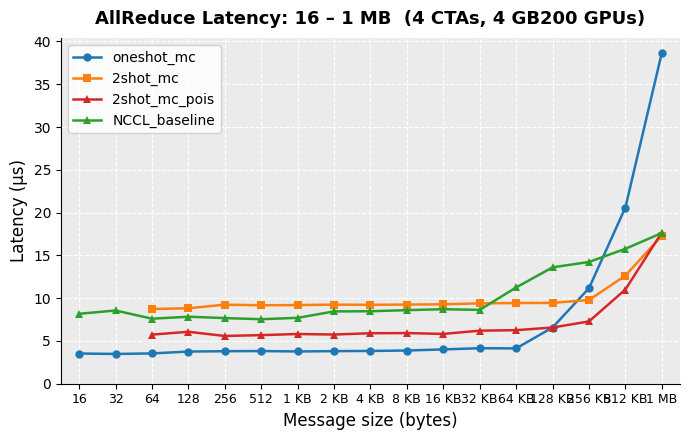
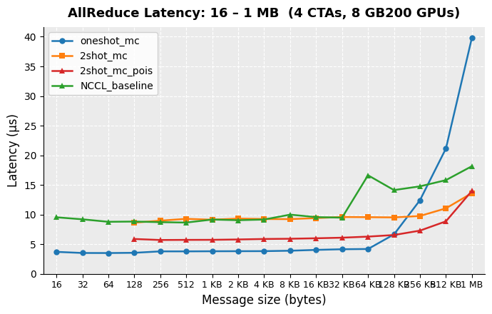

# Custom AllReduce Kernels using the NCCL Device API

This directory contains three example custom CUDA kernels that implement
AllReduce collective operations using NVLink multicast (MC) hardware available
on Hopper/Blackwell GPUs (sm ≥ 9.0).  They are intended to show how
application and library developers can build high-performance AllReduce
algorithms directly on top of the **NCCL device API** (`nccl_device.h`),
without going through the standard NCCL host API.

All three kernels use **multicast virtual addresses** obtained via
`ncclGetLsaMultimemPointer`, which let a single PTX instruction address all
ranks' symmetric buffers simultaneously.  This eliminates unicast round-trips
and enables hardware-reduced AllReduce in one or two NVLink passes.

## Motivation

NCCL exposes a device-side API that gives custom CUDA kernels direct access to
the same NVLink primitives NCCL uses internally:

- **`ncclDevComm`** — device-side communicator passed by value to a kernel;
  carries team membership, barrier slots, window metadata, and the multicast
  base pointer when `lsaMultimem=true`.
- **`ncclGetLsaMultimemPointer`** — resolves the multicast VA for a symmetric
  window, enabling `multimem.*` PTX instructions that address all ranks at once.
- **`ncclLsaBarrierSession`** — lightweight inter-rank barrier that
  synchronises only the GPUs in the LSA team, without CPU involvement.

Key PTX instructions used by these kernels:

| Instruction                             | Effect                                                                                                                 |
|-----------------------------------------|------------------------------------------------------------------------------------------------------------------------|
| `multimem.ld_reduce.global.add.v4.f32` | Atomically loads from all ranks' multicast VA and returns the hardware sum — one instruction performs the full reduction |
| `multimem.st.global.v4.f32`            | Stores to all ranks' multicast VA simultaneously — one instruction broadcasts to every peer's buffer                   |

---

## Kernels

### 1. `oneshot_mc_allreduce_kernel` — Single-pass Multicast AllReduce

**File:** `oneshot_mc_allreduce_kernel.cuh`

Each GPU independently issues `multimem.ld_reduce.add.v4.f32` across the full
message.  The hardware reads ALL ranks' `sendBuff[i]` simultaneously through
the multicast VA and returns the sum directly — no inter-rank software
communication is needed at all.

**Algorithm:**
1. **Reduce** — A grid-stride loop issues one `multimem.ld_reduce` per
   `float4` element, writing the result directly to the local `recvBuff`.
   Every rank executes the same loop independently, so no barriers or
   sentinels are required.

**Trade-off:** The simplest possible kernel.  Latency is dominated by the NVLink
  multicast read latency (~3.5 µs), flat across message sizes (small-message
regime) and independent of rank count.

---

### 2. `twoshot_mc_simple_allreduce_kernel` — Barrier-based Twoshot AllReduce

**File:** `twoshot_mc_simple_allreduce_kernel.cuh`

A two-shot AllReduce (ReduceScatter + AllGather) where both shots are fused
into a single element-wise loop, using multicast hardware for both.

**Algorithm:**
1. **ReduceScatter (Shot 1)** — Each rank is assigned a chunk of
   `nlines / nRanks` elements.  Within its chunk, each thread issues
   `multimem.ld_reduce` to atomically read all ranks' `sendBuff[i]` and obtain
   the reduced sum.
2. **AllGather (Shot 2)** — The reduced value is immediately broadcast to all
   ranks' `recvBuff[i]` via `multimem.st` — a single NVLink multicast store.
   Shots 1 and 2 are fused per element: no intermediate buffer is needed.
3. **Exit barrier** — `ncclLsaBarrierSession` (release/acquire) ensures all
   AllGather stores are globally visible before any rank reads `recvBuff`.

**Trade-off:** Requires an exit barrier, but the two-shot structure means each
rank only reduces `1/nRanks` of the data,
allowing bandwidth to scale with rank count.  `nlines` must be divisible by
`nRanks`.

---

### 3. `twoshot_mc_poison_allreduce_kernel` — Barrier-free Twoshot AllReduce

**File:** `twoshot_mc_poison_allreduce_kernel.cuh`

Eliminates the exit barrier of `twoshot_mc_simple` by using a Lamport sentinel
embedded in each data slot to detect arrival — the same technique used by
`lsa_poison_alltoall_kernel`.

**Algorithm:**
1. **Optional entry barrier** — On the first two iterations per buffer,
   ensures all ranks have finished re-poisoning this buffer before new data
   is written.  Skipped in steady state (`skip_barrier=true`).
2. **ReduceScatter + AllGather** — Identical to `twoshot_mc_simple`: each
   thread issues `multimem.ld_reduce` then `multimem.st` for its assigned
   element.  After `multimem.st`, the `.w` field of `recvBuf[i]` on every
   rank transitions from `LSA_POISON` (`0xFFFAFFFA`) to the real data value.
   Because NVLink issues `float4` stores as single 128-bit transactions,
   observing `.w != POISON` guarantees the full element has arrived in L2.
3. **Poll** — Each rank spins on its local `recvBuf` using
   `cuda::atomic_ref<uint32_t, cuda::thread_scope_system>` with
   `memory_order_relaxed` (`ld.relaxed.sys`), which bypasses the non-coherent
   L1 cache and reads directly from L2 — sufficient to observe remote NVLink
   writes.
4. **Inline re-poison (triple buffering)** — After polling, the kernel
   re-poisons the `.w` field of each slot in `clearBuf` (the buffer used two
   iterations ago), preparing it for reuse without a separate `cudaMemset`.
   Three symmetric buffers rotate each iteration:
   - `recvBuf  = bufs[iter % 3]`       — receives result this iteration
   - `clearBuf = bufs[(iter + 2) % 3]` — re-poisoned inline, ready 1 iter later

**Trade-off:** No exit barrier in steady state.  Latency floor is ~5.6 µs
(NVLink round-trip + poll), flat across rank counts.  Requires three symmetric
buffer allocations and host-side rotation logic.

---

## Performance

Numbers below are for 4 CTAs, measuring per-iteration latency in steady state
(CUDA graph, `skip_barrier=true` for the poison kernel).

### 4 × GB200

| msg    | oneshot_mc (µs) | 2shot_mc (µs) | 2shot_mc_pois (µs) | NCCL (µs) |
|--------|-----------------|---------------|--------------------|-----------|
| 16 B   | 3.53            | N/A           | N/A                | 8.17      |
| 32 B   | 3.48            | N/A           | N/A                | 8.56      |
| 64 B   | 3.54            | 8.73          | 5.74               | 7.60      |
| 128 B  | 3.76            | 8.82          | 6.07               | 7.83      |
| 256 B  | 3.80            | 9.24          | 5.58               | 7.67      |
| 512 B  | 3.82            | 9.17          | 5.68               | 7.54      |
| 1 KB   | 3.77            | 9.19          | 5.81               | 7.70      |
| 2 KB   | 3.81            | 9.24          | 5.75               | 8.45      |
| 4 KB   | 3.83            | 9.22          | 5.90               | 8.47      |
| 8 KB   | 3.88            | 9.25          | 5.92               | 8.60      |
| 16 KB  | 4.01            | 9.28          | 5.82               | 8.71      |
| 32 KB  | 4.15            | 9.39          | 6.20               | 8.63      |
| 64 KB  | 4.13            | 9.43          | 6.26               | 11.25     |
| 128 KB | 6.57            | 9.45          | 6.57               | 13.60     |
| 256 KB | 11.16           | 9.78          | 7.28               | 14.23     |
| 512 KB | 20.59           | 12.64         | 11.01              | 15.77     |
| 1 MB   | 38.66           | 17.29         | 17.67              | 17.61     |



### 8 × GB200

| msg    | oneshot_mc (µs) | 2shot_mc (µs) | 2shot_mc_pois (µs) | NCCL (µs) |
|--------|-----------------|---------------|--------------------|-----------|
| 16 B   | 3.71            | N/A           | N/A                | 9.54      |
| 32 B   | 3.52            | N/A           | N/A                | 9.20      |
| 64 B   | 3.51            | N/A           | N/A                | 8.78      |
| 128 B  | 3.55            | 8.63          | 5.88               | 8.82      |
| 256 B  | 3.79            | 8.97          | 5.71               | 8.72      |
| 512 B  | 3.79            | 9.28          | 5.73               | 8.65      |
| 1 KB   | 3.81            | 9.13          | 5.74               | 9.16      |
| 2 KB   | 3.82            | 9.32          | 5.80               | 9.05      |
| 4 KB   | 3.83            | 9.25          | 5.88               | 9.16      |
| 8 KB   | 3.90            | 9.23          | 5.92               | 9.99      |
| 16 KB  | 4.04            | 9.41          | 6.00               | 9.57      |
| 32 KB  | 4.15            | 9.59          | 6.10               | 9.48      |
| 64 KB  | 4.19            | 9.56          | 6.28               | 16.63     |
| 128 KB | 6.65            | 9.52          | 6.55               | 14.13     |
| 256 KB | 12.42           | 9.76          | 7.29               | 14.76     |
| 512 KB | 21.14           | 11.05         | 8.86               | 15.81     |
| 1 MB   | 39.82           | 13.62         | 14.00              | 18.16     |



**Key observations:**
- `oneshot_mc` achieves ~3.5 µs flat — roughly 2× lower than NCCL — because
  one `multimem.ld_reduce` instruction replaces the entire reduce-scatter phase.
- `twoshot_mc_pois` (~5.7 µs) is faster than `twoshot_mc_simple` (~9 µs) by
  eliminating the exit barrier; its latency is stable across 4 and 8 GPUs.
- All three custom kernels show nearly identical latency at 4 and 8 GPUs,
  confirming the multicast approach scales with rank count.
- NCCL baseline rises from ~8 µs (4 GPUs) to ~9 µs (8 GPUs) in this range.

---

## Building

NCCL must be built first:

```bash
make src.build
```

Then build the benchmark (MPI required):

```bash
make -C contrib/custom_algos/allreduce MPI=1
```

Optional variables:

| Variable    | Default               | Description               |
|-------------|-----------------------|---------------------------|
| `MPI_HOME`  | detected from `mpicc` | Path to MPI installation  |
| `CUDA_HOME` | `/usr/local/cuda`     | Path to CUDA installation |
| `DEBUG=1`   | off                   | Debug build (`-O0 -G -g`) |

The binary is written to `build/test/custom_algos/allreduce/allreduce`.

---

## Running

```bash
mpirun -np <N> build/test/custom_algos/allreduce/allreduce [options]
```

| Option            | Default | Description                              |
|-------------------|---------|------------------------------------------|
| `-c, --min-cta N` | 1       | Smallest CTA count to sweep (power of 2) |
| `-C, --max-cta N` | 1       | Largest CTA count to sweep (power of 2)  |
| `-m, --min-msg B` | 16      | Smallest message size in bytes           |
| `-M, --max-msg B` | 128 MB  | Largest message size in bytes            |
| `--no-graph`      | off     | Disable CUDA graph capture               |

The driver runs correctness tests for all three kernels first, then a
latency sweep printing one row per message size per CTA count.

---

## Prerequisites

- NCCL built from source (this repo)
- CUDA ≥ 12.2
- MPI (OpenMPI or MVAPICH)
- GPU compute capability ≥ 9.0 (Hopper / Blackwell) — required for
  `multimem.ld_reduce` and `multimem.st` PTX instructions
- NVLink island with ≥ 2 GPUs and multicast support enabled
