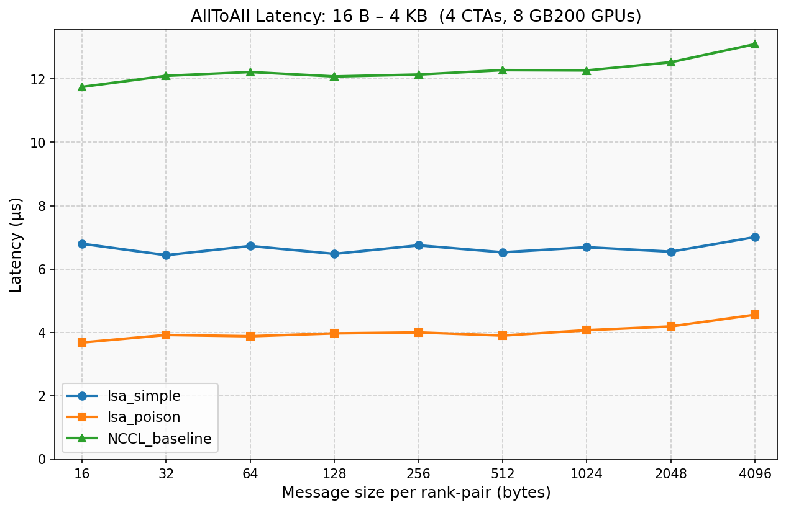
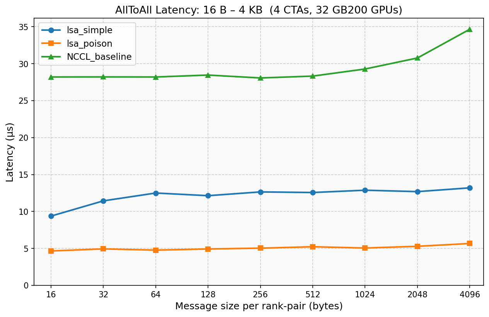

# Custom AllToAll Kernels using the NCCL Device API

This directory contains two example custom CUDA kernels that implement
AllToAll collective operations for GPUs within the same NVLink island (LSA
team).  They are intended to show how application and library developers can
build their own high-performance collective algorithms directly on top of the
**NCCL device API** (`nccl_device.h`), without going through the standard
NCCL host API.

## Motivation

NCCL exposes a device-side API that gives custom CUDA kernels direct access to
the same NVLink primitives NCCL uses internally:

- **`ncclDevComm`** — a device-side communicator handle passed by value to a
  kernel, carrying team membership, barrier slots, and window metadata.
- **`ncclTeamLsa` / `ncclTeamLsa`** — query the local NVLink island (LSA) team:
  rank count, this rank's index.
- **`ncclGetLsaPointer`** — resolve a peer's symmetric buffer address for a
  given `ncclWindow_t`, enabling direct NVLink load/store from inside a kernel.
- **`ncclLsaBarrierSession`** — a lightweight inter-rank barrier that
  synchronises only the GPUs in the LSA team, without CPU involvement.

By combining these primitives, a custom kernel can push data over NVLink,
synchronise ranks, and detect completion — all entirely from the GPU — with
latency and bandwidth characteristics that can exceed what the host-driven NCCL
pipeline achieves for small-to-medium messages.

## Examples

### 1. `lsa_simple_alltoall_kernel` — Barrier-based AllToAll

**File:** `lsa_simple_alltoall_kernel.cuh`

This kernel implements a classic push-based AllToAll: each rank writes its data
into every peer's symmetric receive buffer over NVLink, then uses an LSA
barrier to wait until all ranks have finished writing before any rank proceeds
to read.

**Algorithm:**
1. **Push** — Each block covers a contiguous chunk of the `count` elements.
   Warps are assigned to destinations in round-robin order so all NVLink links
   are active simultaneously.  When more warps than destinations are available,
   multiple warps share a destination to maximise HBM read bandwidth.
2. **Barrier** — An `ncclLsaBarrierSession` synchronises all ranks.  A
   system-scope release fence before the barrier makes the NVLink stores
   globally visible; the barrier's acquire ensures incoming data is visible
   after the wait.

**Trade-off:** The barrier cost grows with rank count.

---

### 2. `lsa_poison_alltoall_kernel` — Barrier-free Poison AllToAll

**File:** `lsa_poison_alltoall_kernel.cuh`

This kernel eliminates the explicit barrier entirely by using a sentinel value
embedded in each data slot to detect arrival.  It is inspired by the
Lamport-clock completion detection used in NCCL's userbuffers path.

**Algorithm:**
1. **Poison convention** — The `.w` field of every `uint4` slot is
   pre-initialised to `LSA_SENTINEL_POISON` (`0xFFFAFFFA`).  Valid data must
   never produce this value.  Because NVLink issues `uint4` stores as a single
   128-bit transaction, observing `.w != POISON` guarantees the entire 128-bit
   element has arrived in L2 — no software acquire fence is needed.
2. **Push** — Same warp-parallel, round-robin push as the barrier kernel.
3. **Poll** — Each thread spins on the `.w` field of its assigned slots using
   `cuda::atomic_ref<uint32_t, cuda::thread_scope_system>` with
   `memory_order_relaxed`.  `thread_scope_system` relaxed loads compile to
   `ld.relaxed.sys`, which bypasses the non-coherent L1 cache and reads
   directly from L2 — sufficient to observe remote NVLink writes.
4. **Inline re-poison (triple buffering)** — After polling, the kernel
   re-poisons a *separate* buffer (`clearBuf`) rather than the receive buffer.
   The receive buffer is left intact so the caller can read the result after
   the kernel returns.  Three symmetric buffers rotate each iteration:
   - `recvBuff = bufs[iter % 3]` — receives incoming data this iteration
   - `clearBuf = bufs[(iter + 2) % 3]` — re-poisons the buffer used 2
     iterations ago, ready for reuse next iteration

   A peer at most one iteration ahead writes to `bufs[(iter+1)%3]`, so
   `clearBuf` is never written concurrently with the clear pass.

**Trade-off:** No barrier means the latency floor is just the NVLink round-trip
time plus poll overhead (~3.7–5.7 µs across 8–32 GPUs), and it scales well
with rank count.  The cost is three symmetric buffer allocations and slightly
more complex host-side rotation logic.

---

## Performance

Numbers below are for a 4 CTA sweep, measuring per-iteration latency in
steady state (CUDA graph, `skip_barrier=true` for poison).

### 8 × GB200

| msg/pair | lsa_simple (µs) | lsa_poison (µs) | NCCL_baseline (µs) |
|----------|-----------------|-----------------|-------------------|
| 16 B     | 6.80     | 3.68          | 11.75     |
| 128 B    | 6.48     | 3.97          | 12.08     |
| 1 KB     | 6.69     | 4.07          | 12.27     |
| 4 KB     | 7.01     | 4.56          | 13.10     |



### 32 × GB200

| msg/pair | lsa_simple (µs) | lsa_poison (µs) | NCCL_baseline (µs) |
|----------|-----------------|-----------------|-------------------|
| 16 B     | 9.38     | 4.66          | 28.20     |
| 128 B    | 12.14    | 4.93          | 28.46     |
| 1 KB     | 12.88    | 5.06          | 29.28     |
| 4 KB     | 13.20    | 5.67          | 34.66     |



The poison kernel's latency is nearly flat across message sizes and rank
counts, since it avoids any all-to-all synchronisation.

---

## Building

NCCL must be built first:

```bash
make src.build
```

Then build the sample (MPI required):

```bash
make -C contrib/custom_algos/alltoall MPI=1
```

Optional variables:

| Variable    | Default                      | Description                  |
|-------------|------------------------------|------------------------------|
| `MPI_HOME`  | detected from `mpicc`        | Path to MPI installation     |
| `CUDA_HOME` | `/usr/local/cuda`            | Path to CUDA installation    |
| `DEBUG=1`   | off                          | Debug build (`-O0 -G -g`)    |

The binary is written to `build/test/custom_algos/alltoall/custom_algos`.

---

## Running

```bash
mpirun -np <N> build/test/custom_algos/alltoall/custom_algos [options]
```

| Option              | Default   | Description                                      |
|---------------------|-----------|--------------------------------------------------|
| `-c, --min-cta N`   | 4         | Smallest CTA count to test (power of 2)          |
| `-C, --max-cta N`   | 4         | Largest CTA count to test (power of 2)           |
| `-m, --min-msg B`   | 4         | Smallest message size in bytes (power of 2)      |
| `-M, --max-msg B`   | 128 MB    | Largest message size in bytes (power of 2)       |
| `--no-graph`        | off       | Disable CUDA graph capture                       |

All ranks must be on NVLink-connected GPUs within the same NVLink island.
CUDA compute capability ≥ 7.0 is required.

---

## Prerequisites

- NCCL built from source (this repo)
- CUDA ≥ 12.2
- MPI (OpenMPI or MVAPICH)
- GPU compute capability ≥ 7.0; NVLink island with ≥ 2 GPUs
