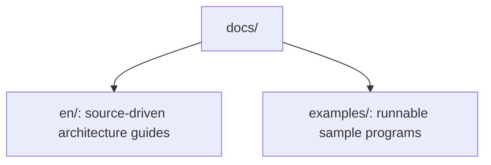

<!--
  SPDX-FileCopyrightText: Copyright (c) 2026 NVIDIA CORPORATION & AFFILIATES. All rights reserved.
  SPDX-License-Identifier: Apache-2.0

  See LICENSE.txt for more license information
-->

# NCCL Repository Learning Guides

This directory complements the official NVIDIA documentation with
source-oriented, repository-local walkthroughs.

## Quick links

- English deep dive: [docs/en/README.md](en/README.md)
- Runnable examples: [docs/examples/README.md](examples/README.md)

The English track is optimized for readers who want to answer questions such as
"why did NCCL pick ring instead of tree?" or "which file should I open after
`ncclAllReduce`?". A mirrored Chinese track will follow in a second commit on the
same branch so the final PR becomes bilingual.

## What is different from the official documentation?

The official user guide explains how to use NCCL as a library. This repository
track explains how the current source tree is organized and how the runtime
actually arrives at its decisions.

## Suggested starting point

1. Read the [English landing page](en/README.md).
2. Continue with [quick-start.md](en/quick-start.md).
3. Keep [examples](examples/README.md) open for runnable reference code.
