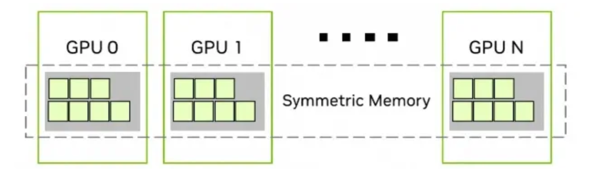
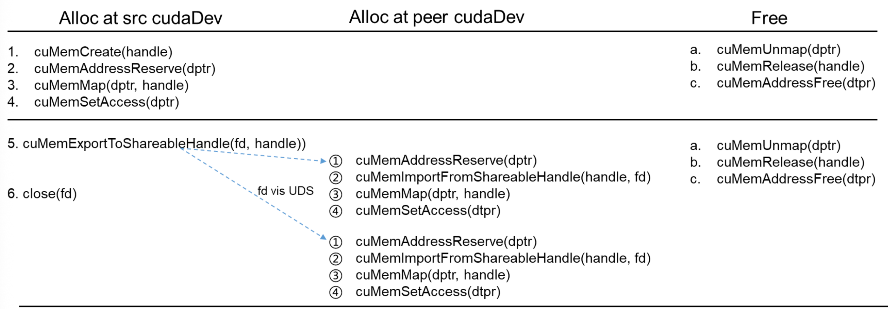

# NCCL GIN & Symmetric Memory

*Original by zartbot · Translated to English*

## TL;DR

This is a side-piece to the DeepSeek v4 series. Because DeepEPv2 calls into the NCCL GIN backend —
and because Symmetric Memory is itself a critical concept for fusing computation and communication —
we will first walk through these topics in some detail. We start from the paper "GPU-Initiated
Networking for NCCL" [1] to motivate why NCCL GIN and Symmetric Memory exist.

In a nutshell: Symmetric Memory abstracts peer-memory access in a distributed system into a flat
virtual-address space, which makes it considerably easier for parallel-computing kernels to reason
about addresses. The communication path itself, however, still requires different semantics: for
NVLink / PCIe peer-to-peer, plain memory semantics suffice; for RDMA scale-out networks, you need
GIN (GPU-Initiated Networking) to issue message-semantic network transfers from the device side.

Outline:

```
1. Symmetric Memory
    1.1 What is Symmetric Memory
    1.2 Symmetric Memory implementation
        1.2.1 Unified abstraction
            1.2.1.1 Memory management
            1.2.1.2 Communication-window registration
            1.2.1.3 Communicator
            1.2.1.4 Peer-notification mechanisms
        1.2.2 LSA
            1.2.2.1 LSA data exchange
            1.2.2.2 LSA synchronization
            1.2.2.3 Low-latency All-to-All
        1.2.3 GIN data exchange
            1.2.3.1 Connection setup
            1.2.3.2 Window registration
            1.2.3.3 GIN communication flow
            1.2.3.4 GIN data synchronization
2. Complete Symmetric Memory example
    2.1 Initialization
    2.2 Allocate symmetric memory and register windows
    2.3 Create the device communicator
    2.4 Launch the kernel and verify
    2.5 Resource cleanup
```

## 1. Symmetric Memory

### 1.1 What is Symmetric Memory

Traditional GPU communication follows a host-driven model: the CPU orchestrates every operation.
Both NCCL and MPI rely on a loosely-coupled, message-passing pattern for cross-node communication.
This requires explicit host-device synchronization, and every transfer is its own kernel launch. For
workloads that demand tight integration of compute and communication — for example expert-parallel
(EP) communication, or compiler-emitted communication inside JAX/Triton kernels — this model is too
coarse-grained: device-initiated communication is needed to eliminate the CPU coordination overhead
introduced by CUDA-based host-side synchronization. The NVSHMEM library has already demonstrated the
feasibility and impact of GPUDirect Async Kernel-Initiated (GDA-KI) capabilities, providing
device-side primitives that fuse communication with computation for AI workloads.

A second driver is the rise of super-pods such as NVL72. On those larger systems the traditional
collective communication pattern incurs noticeable latency and overhead over NVLink, and with
the appearance of DeepEP and similar libraries the communication-library ecosystem has fragmented.
Maintaining several communication libraries is a chore. Starting with v2.28, NCCL added a Device API
that lets GPU threads issue network transfers directly from inside a kernel — this is GPU-Initiated
Networking (GIN).

There are two further forces behind this change. DeepSeek has argued in its papers that the
divergent semantics between scale-up (NVLink) and scale-out (RDMA) introduce real complexity, and
that those semantics should be unified as far as possible. From PyTorch's vantage point, the goal is
to expose a large GPU cluster as a single "giant GPU" with massive memory and compute. Because
DeepEP relied on NVSHMEM, attention has shifted toward a model that has been familiar in HPC for
years: PGAS (Partitioned Global Address Space) built on OpenSHMEM. The idea is that, in a
distributed system, every execution unit can address a shared global address space, which is itself
partitioned and assigned to individual execution units.



### 1.2 Symmetric Memory implementation

Let's unpack this programming model. Why is the memory "symmetric"? Under this model every GPU
allocates memory in the same virtual address space, and any GPU can compute an offset based on
another GPU's rank to access memory that other GPU allocated. Each participating process is mapped
onto a logically unified, but physically partitioned, global virtual address space. The space is
symmetric in the following senses:

1. Across all participating processes, the size and layout of the symmetric-memory virtual address
   space are identical, giving developers a single, uniform programming view.
2. Syntactically, when an arbitrary process X accesses its own local device memory or the memory of
   a remote process Y, the access looks identical regardless of whether Y is reached over a scale-up
   NVLink link or a scale-out RDMA link. The lower-level complexity is hidden.

At the implementation layer there are still two distinct paths:

* LSA (Load/Store Access) for direct memory-semantic access to other peers within the same node.
* GIN (GPU-Initiated Networking) for peers on different nodes.

#### 1.2.1 Unified abstraction

##### 1.2.1.1 Memory management

In conventional CUDA programming we use cudaMalloc and cudaFree to allocate memory. To support
Symmetric Memory we need the cuMem family of APIs, which decouple physical-memory allocation from
virtual-address-space reservation. NCCL wraps this — see the ncclMemAlloc function in
src/allocator.cc.

```cpp
void *d_sendbuff;
void *d_recvbuff;
NCCLCHECK(ncclMemAlloc(&d_sendbuff, size_bytes));
NCCLCHECK(ncclMemAlloc(&d_recvbuff, size_bytes));
```

ncclMemAlloc runs through the following steps:

1. Use ncclCuMemEnable to check that GPU VMM is on.
2. Allocate physical memory with cuMemCreate(&handle, handleSize, &memprop, 0).
3. Reserve a virtual-address range with cuMemAddressReserve((CUdeviceptr\*)ptr, handleSize, ...).
4. Map the VA to physical memory with cuMemMap((CUdeviceptr)\*ptr, handleSize, 0, handle, 0).
5. Finally call cuMemSetAccess((CUdeviceptr)\*ptr, handleSize, &accessDesc, 1) to enable read/write
   access.

It is important to note that for NVLink-connected scenarios, only physical segments produced this
way can be exported via cuMemExportToShareableHandle, handed to another rank, and then re-imported
on the far side with cuMemImportFromShareableHandle + cuMemMap to form a flat VA at the same address
across ranks. Buffers from cudaMalloc expose no exportable memHandle. The cross-node address
allocation and VA mapping pattern follows the diagram in the
[original article](https://github.com/inclusionAI/asystem-amem)
(image by Ant Group's Amem [2]).



Next, ncclDevrInitOnce performs one-time initialization of the symmetric-memory subsystem:

```cpp
if (devr->bigSize != 0) return ncclSuccess;        // idempotent
lsaSize = computeLsaSize(comm);                    // gcd-based, derived from rankToNode
devr->lsaSize     = lsaSize;
devr->lsaSelf     = comm->rank % lsaSize;
devr->lsaRankList = malloc(lsaSize * sizeof(int)); // lsaRankList[i] = rank + (i - lsaSelf)
devr->nLsaTeams   = comm->nRanks / lsaSize;

// 1) Pull the recommended cuMem granularity (typically 2 MB / per-GPU allocation unit)
memProp.type          = CU_MEM_ALLOCATION_TYPE_PINNED;
memProp.location.type = CU_MEM_LOCATION_TYPE_DEVICE;
cuMemGetAllocationGranularity(&devr->granularity, &memProp,
                              CU_MEM_ALLOC_GRANULARITY_RECOMMENDED);

// 2) Determine bigSize: NCCL_WIN_STRIDE; default = max totalGlobalMem across all rank GPUs
devr->bigSize = ncclParamWinStride();
if (-devr->bigSize <= 1) {
  devr->bigSize = 1;
  for (r=0; r<nRanks; ++r)
    devr->bigSize = max(devr->bigSize, peerInfo[r].totalGlobalMem);
}
devr->bigSize = alignUp(devr->bigSize, 1ULL<<32);  // align to 4 GB
ncclSpaceConstruct(&devr->bigSpace);  // initialize the VA allocator
ncclShadowPoolConstruct(&devr->shadows);
```

Terminology used here:

* bigSize: the size of the per-rank virtual-address window inside the unified symmetric view (e.g. 128 GB, aligned to 4 GB).
* bigSpace: a linear integer-allocator ncclSpace that hands out only *relative offsets* — it does not allocate physical VA.
* lsaFlatBase: reserves a contiguous VA region of lsaSize × bigSize, with each rank occupying one bigSize slice.
* granularity: the cuMem physical-allocation granularity. All window sizes must be aligned to it.

At this point `bigSpace` still holds no actual VA, and `lsaFlatBase` has not yet been created.
`ncclSpaceAlloc` then allocates within the symmetric-memory VA space bigSpace. The allocations are
tracked purely on the host side by the `ncclSpace` bookkeeping object; the resulting `bigOffset` later
drives `cuMemMap` / `cuMemAddressReserve`.

```cpp
struct ncclSpace {
  int count;        // number of valid entries in cuts[]
  int capacity;     // capacity of cuts[] (grows by doubling)
  int64_t* cuts;    // strictly-increasing array of "cut points"
};
```

The allocator views the integer interval [0, limit) as being divided by a sequence of cut points
into *alternating full/empty segments*. Full/empty status is given by isFull(i) = (i % 2 != count %
2):

* If count is even → even-index segments are empty, odd-index are full.
* If count is odd → even-index segments are full, odd-index are empty.

The last segment (index count) is always empty, which lets the allocator keep appending at the tail.

Worked example with bigSize = 128 GB, granularity = 2 MB, and two successive allocations of 4 MB and
8 MB:

Initial state:

```cpp
count=0, cuts=[]    segments: [0, 128 GB) empty
```

alloc(4 MB):

* i = 0, lo=0, hi=128 GB, off=0, off+size=4 MB ≤ hi — hit.
* i == 0 takes the slow path: insertSegment(0, 0, 4 MB).
* Insert cuts=[0, 4 MB]; merge: leading 0 is dropped → cuts=[4 MB], count=1.
* Segments: [0,4 MB) full | [4 MB,128 GB) empty.
* Returns bigOffset = 0.

alloc(8 MB):

* i = count%2 = 1, lo=cuts[0]=4 MB, hi=128 GB, off=4 MB (already 2 MB-aligned).
* Hit, fast path: cuts[i-1] = cuts[0] = 4 MB + 8 MB = 12 MB.
* cuts=[12 MB], count=1.
* Segments: [0,12 MB) full | [12 MB,128 GB) empty.
* Returns bigOffset = 4 MB.

free(offset=0, size=4 MB):

* Find full segment i=0: lo=0, hi=12 MB.
* lo==offset && offset+size!=hi → fast path cuts[i-1].
* But i==0 has no cuts[-1]; the i!=0 guard falls back to insertSegment(0, 0, 4 MB).
* cuts=[0, 4 MB, 12 MB] → merge leading 0 → cuts=[4 MB, 12 MB], count=2.
* Segments: [0, 4 MB) empty | [4 MB, 12 MB) full | [12 MB, 128 GB) empty.

Symmetry guarantee:

All ranks call this function in the same order during the registration flow, so bigSpace evolves
deterministically — every rank ends up with the same bigOffset.

Inside symMemoryObtain, the call converts a set of physical-allocation handles
memHandles[numSegments] already held by the local rank into a *symmetric-memory object*
ncclDevrMemory* that spans the LSA team — and across nodes via GIN/RMA. Concretely:

* Allocate a bigOffset inside devr->bigSpace — identical across ranks.
* Map the same physical memory of every peer in the LSA team into a unified flat VA at lsaFlatBase + r*bigSize + bigOffset.
* Complete NVLS multicast / GIN / RMA Proxy registration.

Execution flow:

```text
symMemoryObtain
 ├── Stage 1: dedup lookup (primaryAddr + size + numSegments + handles must match exactly)
 ├── Stage 2: build ncclDevrMemory skeleton + fill segmentSizes
 ├── Stage 3: global allgather of numSegments / hasSysmem → aggregated max/global flags + lsaNumSegments
 ├── Stage 4: ncclSpaceAlloc carves out bigOffset
 ├── Stage 5: symMemoryMapLsaTeam constructs lsaFlatBase VA + maps each peer's physical segment
 ├── Stage 6: backfill primaryAddr (for callers that didn't supply a VA)
 ├── Stage 7: symBindTeamMemory binds NVLS multicast
 ├── Stage 8: symMemoryRegisterGin / symMemoryRegisterRma — cross-node registration
 └── Stage 9: link into devr->memHead, refCount=1, return
```

On NVLink, the local rank's handle is exported as follows:

```cpp
for (int seg = 0; seg < numSegments; seg++) {
  symLsaMessage* msg = messages + devr->lsaSelf * maxSegments + seg;
  symMemoryExportSegmentHandle(comm, msg, mem->memHandles[seg], segmentSizes[seg]);
}
```

Step by step: derive CUmemAllocationProp from memHandle → fill msg->type (DEVICE / HOST_NUMA), set
msg->segmentSize = segmentSize.

* POSIX fd mode: drop memHandle itself in (the receiver fetches the fd through proxy).
* FABRIC mode: call cuMemExportToShareableHandle(&msg->fabricHandle, memHandle, ncclCuMemHandleType, 0) to export a fabric handle.

Then an LSA-team allgather synchronizes the messages, and every node maps each peer's physical
segment to the corresponding VA:

```cpp
for (int r = 0; r < devr->lsaSize; r++) {
  symMemoryImportAndMapSegmentsForRank(comm, r, messages, maxSegments,
                                       mem->lsaNumSegments[r],
                                       mem->memHandles, mem->bigOffset);
}
```

For the cross-node side, symMemoryRegisterGin (GDAKI / RDMA) or symMemoryRegisterRma (CPU proxy)
handles the build-out.

The final flat-VA layout:

```text
[ lsaFlatBase ]
|  rank 0 bigSize  |  rank 1 bigSize  |  ...  | rank (lsaSize-1) bigSize
         ↑                    ↑
  bigOffset + seg0      bigOffset + seg0
  (rank 0 physical seg 0)  (rank 1 physical seg 0)
```

On the device side, accessing the same-named memory of peer x reduces to a simple address
calculation: lsaFlatBase + x * bigSize + bigOffset + user_offset.

##### 1.2.1.2 Communication-window registration

ncclCommWindowRegister is the user-facing entry point of NCCL's symmetric-memory model. It registers
a CUDA virtual-memory range (buff, size) as a window that all ranks share the *same logical view*
of, and returns a device-usable ncclWindow_t.

```cpp
ncclWindow_t send_win;
NCCLCHECK(ncclCommWindowRegister(comm, d_sendbuff, size_bytes, &send_win,
                                 NCCL_WIN_COLL_SYMMETRIC));
```

Why is window registration needed? A few reasons:

* Unified symmetric VA view. A raw cudaMalloc / cuMemCreate gives every rank an unrelated VA — peer
  ranks' buff simply isn't reachable from this rank. After registration, NCCL builds the unified
  lsaFlatBase VA layout, and the same window on every rank maps to flatBase + r*bigSize + bigOffset,
  so a kernel can address any peer with the pure arithmetic lsaFlatBase + peer*stride + offset.
* Cross-rank physical-handle exchange. cuMemMap of peer memory needs the peer's
  CUmemGenericAllocationHandle (POSIX fd or FABRIC handle). The export → proxy/fd → import → map
  sequence has to be done by NCCL as a bootstrap collective; the user could never plumb it themselves.
* Aggregating multiple backends. Scale-up (NVLink) and scale-out (RDMA) need different communication
  semantics. Window registration handles them in one shot:
  * Within an LSA team: cuMemMap + cuMemSetAccess → native GPU P2P / NVLS access.
  * NVLS multicast: cuMulticastBindAddr → ld/st.multimem available.
  * GIN (GDAKI / RDMA): ncclGinRegister → cross-node RDMA access.
  * RMA Proxy: ncclRmaProxyRegister → cross-node CPU-proxy channel.
  * Local registration handle: ncclCommRegister → zero-copy recognition for collectives.

The end product is a device-visible ncclWindow_vidmem (containing flat base, stride4G, mcOffset4K,
the array of GIN handles, etc.) that the device kernel consumes directly. This is the only path
through which ncclDevice_* APIs can touch memory. The ncclWindow_t struct, typedef'd in nccl.h to
ncclWindow_vidmem*, looks like:

```cpp
struct ncclWindow_vidmem {
  void* winHost;
  char* lsaFlatBase;
  int lsaRank;
  int worldRank;
  uint32_t stride4G;
  uint32_t mcOffset4K;
  uint32_t ginOffset4K;
  ncclGinWindow_t ginWins[NCCL_GIN_MAX_CONNECTIONS];
  struct ncclSegmentWindow* ginMultiSegmentWins; // multi-segment: pointer to accommodate variable count
  int numSegments;
};
```

| **Field** | **Meaning** | **device-side use** |
| :--- | :--- | :--- |
| winHost | Host-side ncclDevrWindow* | used host-side for lookup / debug / destroy. |
| lsaFlatBase | Window base address of LSA team rank 0. | lsaFlatBase + peer\*stride yields the peer's window base. |
| lsaRank / worldRank | My rank | Lets the kernel know its own position. |
| stride4G | bigSize >> 32 | add4G(base, peer * stride4G) gets the peer's base. |
| mcOffset4K | bigOffset >> 12 | Multicast VA = mcBasePtr + mcOffset4K * 4K. |
| ginOffset4K | memOffset >> 12 | The window's 4 KB offset inside GIN memory. |
| ginWins[4] | Remote handle for each GIN connection | used as the GIN put/get target. |
| ginMultiSegmentWins | Per-segment ncclSegmentWindow array for multi-segment elastic buffers. | Multi-segment GIN path. |
| numSegments | Number of GIN segments | selects the single-segment vs multi-segment path. |

Registration is driven by an allgather of ncclDevrRegTask across all ranks. Each task is then
registered through ncclDevrWindowRegisterInGroup, and finally symWindowCreate produces the window
object, which allocates the host-side ncclDevrWindow:

```cpp
struct ncclDevrWindow* win = malloc(sizeof(*win));
memset(win, 0, sizeof(*win));
win->memory         = mem;
win->size           = userSize;
win->bigOffset      = mem->bigOffset + memOffset;   // window offset within flat = mem offset + intra-mem offset
win->winFlags       = winFlags;
win->localRegHandle = localReg;
if (userPtr == nullptr) {
  win->userPtr = userPtr = (char*)devr->lsaFlatBase
                         + devr->lsaSelf*devr->bigSize + mem->bigOffset;
} else {
  win->userPtr = userPtr;
}
```

*Note: win->bigOffset and mem->bigOffset are not the same. The same mem block can be registered as
multiple windows (for example to expose disjoint sub-ranges to the user); each window carries its
own memOffset.*

It then allocates the device-side window struct ncclWindow_vidmem:

```cpp
struct ncclWindow_vidmem* winDev;       // device address
struct ncclWindow_vidmem* winDevHost;   // host shadow
ncclShadowPoolAlloc(&devr->shadows, &winDev, &winDevHost, stream);
win->vidmem = winDev;

winDevHost->lsaFlatBase = (char*)devr->lsaFlatBase + win->bigOffset;  // ★ peer rank 0 window base
winDevHost->mcOffset4K  = win->bigOffset >> 12;           // NVLS multicast offset (4 KB units)
winDevHost->stride4G    = devr->bigSize >> 32;            // stride between adjacent rank bases (4 GB units)
winDevHost->lsaRank     = devr->lsaSelf;
winDevHost->worldRank   = comm->rank;
winDevHost->winHost     = (void*)win;                     // back-pointer to host ncclDevrWindow
winDevHost->ginOffset4K = memOffset >> 12;                // window's GIN offset within mem
winDevHost->numSegments = mem->numGinSegments;
for (i=0; i<NCCL_GIN_MAX_CONNECTIONS; i++)
  winDevHost->ginWins[i] = mem->ginDevWins[i];            // GIN device-handle array

allocAndPopulateSegmentWindows(...);                      // multi-segment GIN: fill ginMultiSegmentWins
winDevHost->ginMultiSegmentWins = segmentWindowsDev;

cudaMemcpyAsync(winDev, winDevHost, sizeof(ncclWindow_vidmem), H2D, stream);  // ★ sync to device
```

##### 1.2.1.3 Communicator

The actual communication is unified through ncclSymkDevComm:

```cpp
struct ncclSymkDevComm {
  struct ncclDevComm devComm;                // base device communicator (global info)
  struct ncclLLA2AHandle lsaLLA2A;           // LSA: intra-node low-latency A2A handle
  struct ncclGinOutboxHandle ginOutbox;      // GIN: cross-node send mailbox
  ncclGinCounter_t ginCounterPerBlock;       // GIN: per-block completion counter
  struct ncclGinInboxA2AHandle ginInboxRail; // GIN: cross-node receive mailbox along the rail
  struct ncclGinSyncHandle ginSyncHandle;    // GIN: cross-node signal set
};
```

ncclSymkDevComm stores LSA and GIN handlers side by side. They share the same embedded ncclDevComm —
i.e. the same symmetric-memory space and the same per-resource ID-allocation table.

* Host side: a unified ncclDevCommRequirements + ncclDevResourceRequirements linked list describes
  the resource needs, all allocated and mapped in one pass by ncclDevrCommCreateInternal.
* Device side: templated session objects (`ncclLLA2ASession`, `ncclLsaBarrierSession`,
  `ncclGinOutboxSession`, `ncclGinInboxA2ASession`) expose the primitives, and kernels combine them
  as needed.

The host side calls ncclSymkInitOnce to allocate everything in one go:

* Buffers, signals and counters from every backend share the same ncclDevResourceRequirements type
  and live in the same linked list.
* At runtime, lsaRanks < nRanks decides whether GIN resources are needed at all.
* Once allocated, each resource writes its handle / id back into the corresponding field on kcomm,
  so the device side can grab every handle at once via args->kcomm.

On the device side, when a kernel launches it receives an ncclSymkDevWorkArgs carrying every handle:

```cpp
struct ncclSymkArgsHandler {
  ncclDevComm       const& comm;
  ncclLLA2AHandle   const& lsaLLA2A;
  ncclGinOutboxHandle    const& ginOutbox;
  ncclGinInboxA2AHandle  const& ginInboxRail;
  ncclGinCounter_t         ginCounterPerBlock;
  ncclGinSyncHandle const& ginSyncHandle;
  ...
};
```

It is worth noting that the data-send APIs are *not* unified. Kernels combine three team tags
(ncclTeamTagLsa / ncclTeamTagRail / ncclTeamTagWorld) with four session classes
(ncclLsaBarrierSession, ncclLLA2ASession, ncclGinOutboxSession, ncclGinInboxA2ASession), as needed.
ncclTeamTagRail exists for the multi-rail RDMA scale-out topologies common in deployment, and we'll
come back to it later.

*Author's note: Symmetric Memory & GIN really just wrap a fairly intricate communication pattern in
a more approachable abstraction — a single, unified symmetric-address space that simplifies
parallel-compute kernel development. But the underlying execution still involves a lot of complex
operations and synchronization. For example, GIN still has to construct RDMA WQEs (in GDA-KI mode)
or GPU-Function Descriptors (GFDs, in proxy mode).

Synchronization is similarly intricate: TMA's
async proxy interacts with direct LD/ST and with RDMA-side synchronization, and the overall picture
gets messy. There is room for hardware to evolve here — for example, by bringing the scale-out NIC
into the scale-up domain so the software does not have to juggle LSA and GIN semantics. Unifying TMA
descriptors with GFDs would similarly lower the programming burden. I'll write a separate piece on
this in the future.*

##### 1.2.1.4 Peer-notification mechanisms

| Mechanism | Use case | Implementation | Triggered / Carried by |
| :---- | :---- | :---- | :---- |
| Flag/Epoch (LLA2A) | Intra-node small messages. | 8 B flag inside a 16 B slot encodes valid + epoch. | sender's send. |
| LSA Barrier (atomic counter) | Intra-node CTA-level sync. | Atomic / multimem.red on a shared buffer. | arrive() / wait(). |
| GIN Signal (ncclGin_SignalInc/Add/Set) | Cross-node notification. | The remote action of put atomically increments the value at the destination. | put |
| GIN Counter (ncclGin_CounterInc) | Local source-completion. | The local action of put atomically increments the value locally. | put |

#### 1.2.2 LSA

##### 1.2.2.1 LSA data exchange

LSA supports both plain LD/ST and NVLink multicast. Address calculation is just:

```cpp
// local big-VA base
ncclGetLocalPointer(w, offset):
    return lsaFlatBase + lsaRank * stride4G + offset

// big-VA of peer #peer in the LSA team
ncclGetLsaPointer(w, offset, peer):
    return lsaFlatBase + peer * stride4G + offset      // stride4G is in 4 GB units

// multicast write address (one write broadcasts to all ranks)
ncclGetMultimemPointer(w, offset, mm):
    return mm.mcBasePtr + (mcOffset4K << 12) + offset
```

Communication itself is just LD/ST plus, on platforms that support it, NVLink multicast STMC/LDMC:

* LDMC (`multimem.ld_reduce`): a single instruction sent to the NVLS switch, which fetches the same
  address from every peer, reduces them, and returns the reduced value.
* STMC (`multimem.st`): a single instruction that writes a value into the same address on every peer.

```cpp
for (int peer=0; peer<nRanks; peer++) {
    float* sendPtr = (float*)ncclGetLsaPointer(sendwin, sendoffset, peer);
    v += sendPtr[offset];     // direct read of peer device memory
}
for (int peer=0; peer<nRanks; peer++) {
    float* recvPtr = (float*)ncclGetLsaPointer(recvwin, recvoffset, peer);
    recvPtr[offset] = v;            // direct write of peer device memory
}
// STMC / LDMC
tmp[u] = applyLoadMultimem<Red, BytePerPack>(red, inputUptr + cursor);   // one fetch + hardware reduce
multimem_st_global(outputUptr + cursor, tmp[u]);                         // one write broadcast to LSA team
```

##### 1.2.2.2 LSA synchronization

(For background on the NVIDIA GPU memory model, see the companion piece "Notes on the GPU Memory
Model and the Design of the Interconnect Network".)

LSA synchronization is implemented through ncclLsaBarrierSession. The supporting data structures
live in src/include/nccl_device/impl/lsa_barrier__types.h: ncclLsaBarrierSession_internal is the
*internal-state container* of an LSA barrier and holds everything needed for one barrier session.
The device-side ncclLsaBarrierSession inherits from it, packing state, address-derivation methods
and wait logic into a single class.

```cpp
struct ncclLsaBarrierHandle {
    ncclDevResourceHandle_t bufHandle;
    int nBarriers;          // typically = ncclSymkMaxBlocks(64); one barrier per block
};

template<typename Coop>
struct ncclLsaBarrierSession_internal {
    Coop               coop;        // CTA / warp coop domain (thread_rank / sync)
    ncclDevComm const& comm;        // global comm; contains LSA resource-pool pointer
    ncclTeam           team;        // LSA team coordinates {nRanks, rank, stride}
    ncclLsaBarrierHandle handle;    // resource handle {bufHandle, nBarriers}
    int                index;       // index of this session within nBarriers (typically = blockIdx.x)
    bool               multimem;    // backend mode: NVLS multimem or unicast
    ncclMultimemHandle mmHandle;    // multimem virtual base
    uint32_t           epoch;       // current epoch counter
    uint32_t* mcInbox(bool multimem) { ... }
    uint32_t* ucInbox(int owner, int peer) { ... }

    template<bool EnableTimeout>
    ncclResult_t waitInternal(Coop, cuda::memory_order, uint64_t timeoutCycles);
};
```

nBarriers is typically ncclSymkMaxBlocks(64) — one barrier slot per block. Each CTA uses its
blockIdx to address its slot, so the nBarriers blocks share the same state array but never trample
each other. The state array has four segments:

```cpp
state[0 .. nBarriers)                     : local MC epoch cache
state[nBarriers .. 2*nBarriers)           : local UC epoch cache
state[2*nBarriers + index]                : mcInbox (multicast aggregate counter)
state[3*nBarriers + index*nRanks + peer]  : ucInbox (unicast fanout)
```

The first two are persistent epoch storage; the last two are the actual sync slots. Address
derivation:

```cpp
// multicast counter (one slot per barrier)
uint32_t* mcInbox(bool multimem) {
    state = multimem ? ResourceBufferMultimemPointer(...)
                     : ResourceBufferLocalPointer(...);
    return state + 2*nBarriers + index;
}

// unicast fanout cell (matrix [index][peer])
uint32_t* ucInbox(int owner, int peer) {
    state = ResourceBufferPeerPointer(team, owner);   // owner's memory
    return state + 3*nBarriers + index*team.nRanks + peer;
}
```

* `mcInbox` uses *multicast-write + unicast-read*: arrive issues a single `multimem.red.add` PTX
  instruction that accumulates into the same slot on every rank; wait performs a local
  `ld.acquire.sys` to read its own copy.
* `ucInbox` is one cell per (owner, peer) pair: the peer leaves a "I'm here" mark in the owner's memory.

*Why both multicast and unicast? On newer platforms with NVLink Switch SHARP capabilities, you can
send a single multicast to the NVLink switch and have the switch broadcast it to every other GPU, so
newer platforms (Hopper and later) generally use multicast (multimem). Older platforms — or
platforms without an NVLink scale-up fabric, like the RTX 6000 Pro — must fall back to unicast for
synchronization.*

Epoch persistence:

Each barrier persists its own epoch independently (slots `0..nBarriers` for MC, slots
`nBarriers..2 * nBarriers` for UC), so the same barrier resource can be relayed across consecutive
kernels. In code, the constructor ncclLsaBarrierSession reads the previous epoch back, and after
sync the destructor ~ncclLsaBarrierSession writes it out again.

arrive:

During synchronization, arrive notifies peers that "I'm here". On platforms with multimem (NVLS),
this is a direct PTX op:

```cpp
if (multimem) {
    if (coop.thread_rank() == 0) {
        uint32_t* inbox = mcInbox(/*multimem=*/true);   // multicast address
        if (release != relaxed) {
            asm("multimem.red.release.sys.add.u32 [%0],1;" :: "l"(inbox) : "memory");
        } else {
            asm("multimem.red.relaxed.sys.add.u32 [%0],1;" :: "l"(inbox) : "memory");
        }
   }
}
```

Only the leader thread participates. The PTX semantics:

* `multimem.red.*.sys.add.u32`: the NVLS switch hardware-multicasts "+1" to the same physical slot on every team rank and atomically adds it on each.
* `.release.sys`: optional release semantics — guarantees that all .sys-scope stores prior to arrive are visible to other GPUs.
* `.relaxed`: this is intra-kernel sync (there are other fences later), so we save a fence and gain performance.

Without multimem, take the unicast path:

```cpp
if (team.nRanks > 1) {
    // Explicit fence: the following stores are 'relaxed', so we need a release fence first
    // to make the data visible.
    cuda::atomic_thread_fence(releaseOrderOf(order));
}
// All threads write in parallel: nRanks-1 destinations divided over coop.size() threads.
for (int i = coop.thread_rank(); i < team.nRanks-1; i += coop.size()) {
    int peer = i + (team.rank <= i ? 1 : 0);            // skip self
    cuda::atomic_ref<uint32_t> inbox(*ucInbox(peer, team.rank));
    inbox.store(epoch+1, cuda::memory_order_relaxed);   // write peer's mailbox
}
```

wait:

First the multimem case. NVLS makes a single arrive bump the slot value visible on every rank by 1.
With nRanks ranks all arriving, the total increment is nRanks, so the wait condition is count >=
epoch + nRanks, and each round consumes nRanks.

```cpp
// only the leader thread waits
if (coop.thread_rank() == 0) {
    cuda::atomic_ref<uint32_t> inbox(*mcInbox());  // ★ unicast read
    while (true) {
        uint32_t got = inbox.load(acquireOrderOf(order));
        // handle epoch wraparound
        if (got - (epoch + nRanks) <= uint32_t(-1)>>1) break;
        // optional cycle-based timeout while waiting
        if (EnableTimeout && clock64() - startCycle >= timeoutCycles) { ret=ncclTimeout; break; }
        else if (testAbort(abortFlag, steps)) break;
    }
    epoch += nRanks;   // each barrier consumes nRanks
}
```

In the unicast case, since arrive does ucInbox(peer, self).store(epoch+1) — only epoch+1 — wait
reads the local mailbox: ucInbox(self, peer).load() >= epoch+1. Each thread watches one peer's
mailbox; nRanks-1 peers spread across coop.size() threads, all waiting in parallel. Then epoch += 1
advances to the next round.

```cpp
for (int i = coop.thread_rank(); i < nRanks-1; i += coop.size()) {
    int peer = i + (team.rank <= i ? 1 : 0);
    cuda::atomic_ref<uint32_t> inbox(*ucInbox(team.rank, peer));   // ★ read local ucInbox
    while (true) {
        uint32_t got = inbox.load(acquireOrderOf(order));
        if (got - (epoch + 1) <= uint32_t(-1)>>1) break;
        ...abort/timeout checks...
    }
}
epoch += 1;
```

##### 1.2.2.3 Low-latency All-to-All

LLA2A is the small-message high-throughput all-to-all primitive built by NCCL on top of LSA
symmetric memory. It drops the separate flag array and packs 8 B data + double-epoch flags into one
16 B transaction, taking advantage of NVLink's atomic 16 B store guarantee. A single atomic store
therefore both delivers the data and signals completion. The code lives in
src/nccl_device/ll_a2a.cc, with the supporting types in
src/include/nccl_device/impl/ll_a2a__types.h:

```cpp
struct ncclLLA2AHandle {
  ncclDevResourceHandle_t bufHandle;   // symmetric resource buffer handle
  uint32_t nSlots;                     // slots per block per epoch
};

#if NCCL_CHECK_CUDACC
template<typename Coop>
struct ncclLLA2ASession_internal {
  Coop coop;                      // coop group (warp / block / thread abstraction)
  ncclDevComm const& comm;        // device-side communicator reference
  ncclTeam team;                  // ranks participating in this A2A
  ncclLLA2AHandle handle;         // resource handle (incl. nSlots)
  int block;                      // which block this session uses (one CUDA block / concurrency unit)
  int pitch;                      // when T spans multiple uint4s, stride between adjacent uint4s in the slot dimension
  bool multimem;                  // whether to multicast-write multiple peers in one go
  ncclMultimemHandle mmHandle;    // multimem handle
  uint32_t epoch;
  uint32_t slotsOffset;           // starting slot offset of the current epoch within this block (units of uint4)

  NCCL_DEVICE_INLINE uint32_t calcSlotOffset() const {
    return block*(1 + 2*handle.nSlots) + 1 + (epoch & 1)*handle.nSlots;
    // block*(1 + 2*nSlots) : skip to this block's start
    // +1                   : skip block header storing "previous epoch" metadata
    // + (epoch & 1)*nSlots : double-buffer choice; odd/even epoch use different halves
    }
};
```

Memory layout:

```cpp
outReq->bufferSize  = nBlocks * (1 + 2*nSlots) * 16;  // 16 = sizeof(uint4)
outReq->bufferAlign = 16;
```

uint4 (16 B) is the smallest unit; per-block layout follows the formula above.

Lifecycle:

LLA2A wraps lifecycle in an ncclLLA2ASession — see src/include/nccl_device/impl/ll_a2a__funcs.h.
Only the first uint4 of the header is used to persist epoch. At runtime: construct a session, call
send/recv/bcast, destroy the session.

Constructor:

```cpp
uint4* line = (uint4*)ncclGetResourceBufferLocalPointer(comm, handle.bufHandle);
line += block*(1 + 2*handle.nSlots);   // locate header line
this->epoch = line->x + 2;             // ★ read back persisted epoch + 2
this->slotsOffset = this->calcSlotOffset();
```

Destructor: only the leader writes back the current epoch (minus 2 to leave a gap for next time),
then everyone syncs.

```cpp
if (coop.thread_rank() == 0) line->x = this->epoch - 2;
this->coop.sync();
```

*Why epoch + 2? On destroy we write epoch - 2. Stale slots left across sessions may carry old epoch
values like last_epoch or last_epoch+1; only after a +2 jump can we be sure new sessions cannot
collide with those stale tags during reads.*

Splitting large messages:

When sizeof(T) > 8, divUp(sizeof(T), 8) uint4s make up one logical slot. The v-th uint4 is stored
at:

```cpp
addr = buf + slotsOffset + elt + v * pitch
```

With divUp(sizeof(T),8) plus a pitch stride, T can be of any size; every 8 B of data uses one 16 B
slot, and pitch lets multiple slots interleave to reduce bank conflicts.

Send:

```cuda
void send(int peer, int elt, T data) {
    union { T tmp; uint32_t u32[divUp(sizeof(T),8)][2]; };
    tmp = data;

    // 1. obtain peer's slot address (via LSA symmetric VA)
    uint4* buf = ncclGetResourceBufferPeerPointer(comm, handle.bufHandle, team, peer);
    buf += this->slotsOffset + elt;

    // 2. one 16 B atomic store per 8 B of data
    for (int u=0; u < divUp(sizeof(T),8); u++) {
        asm volatile("st.relaxed.sys.v4.u32 [%0],{%1,%3,%2,%3};" ::
            "l"(buf + u*this->pitch),
            "r"(u32[u][0]), "r"(u32[u][1]), "r"(this->epoch)
            : "memory");
  }
}
```

The wire format is uint4 = {data_lo, epoch, data_hi, epoch}. .sys scope makes it valid across
NVLink, while .relaxed semantics avoid an unnecessary fence for top performance:

```cpp
st.relaxed.sys.v4.u32 [addr], {u32[u][0], epoch, u32[u][1], epoch};
                              ^^^^^^^^^^  ^^^^^  ^^^^^^^^^^  ^^^^^
                                 x         y        z         w
```

Broadcast:

There is also a broadcast path that exploits NVLS:

```cuda
uint4* bufmc = ncclGetResourceBufferMultimemPointer(comm, handle.bufHandle, mmHandle);
bufmc += this->slotsOffset + elt;
asm volatile("st.relaxed.sys.v4.u32 [%0],{%1,%3,%2,%3};" ...);
```

On non-NVLS environments, use unicast unrolling:

```cpp
int r = this->team.rank;       // start from self
for (; dr+8 <= nRanks; dr += 8) {
    #pragma unroll
    // unroll-8 keeps LDG/STG pipelined; 8-way concurrency hides typical NVLink latency
    for (int ur=0; ur < 8; ur++) {
        uint4* buf = ncclGetResourceBufferPeerPointer(comm, handle.bufHandle, team, r);
        buf += slotsOffset + elt;
        // same PTX as send
        r = (r+1) % team.nRanks;
    }
}
```

Recv:

Recv has several variants. The shared idea is that the receiver software treats y == epoch && w ==
epoch as proof that the data is fully visible.

recvUnrolled:

```cuda
void recvUnrolled(int eltStart, int eltCount, int eltStride, T (&elts)[MaxEltCount]) {
    uint4* buf = ncclGetResourceBufferLocalPointer(comm, handle.bufHandle);   // ★ local slots
    buf += this->slotsOffset + eltStart;
    uint4 tmp[MaxEltCount][divUp(sizeof(T),8)];
    // ——— outer poll loop ———
    while (!testAbort(comm.abortFlag, steps)) {
        // ——— inner unroll: read all MaxEltCount slots in one shot ———
        for (int u=0; u < MaxEltCount; u++) {
            if (u < MinEltCount || u < eltCount) {
                asm volatile("ld.acquire.sys.v4.u32 {%0,%1,%2,%3},[%4];"
                    : "=r"(tmp[u][v].x), "=r"(tmp[u][v].y),
                      "=r"(tmp[u][v].z), "=r"(tmp[u][v].w)
                    : "l"(buf + u*eltStride + v*pitch) : "memory");
            }
        }
        // ——— check the dual tags on every slot ———
        bool okAll = true;
        for (int u=0; u < MaxEltCount; u++)
            for (int v=0; v < divUp(sizeof(T),8); v++)
                if (u < MinEltCount || u < eltCount) {
                    okAll &= (tmp[u][v].y == epoch && tmp[u][v].w == epoch);
                }
        if (okAll) break;   // exit only when every slot is valid
    }
    // ——— unpack data bits (drop tag bits) ———
    for (int u=0; u < MaxEltCount; u++) {
        union { T val; uint32_t u32[...][2]; };
        u32[v][0] = tmp[u][v].x;   // data_lo
        u32[v][1] = tmp[u][v].z;   // data_hi
        elts[u] = val;
    }
}
```

In ld.acquire.sys.v4.u32, .acquire guarantees that once the epoch tag is observed, every memory
operation that happened before the tag's store is visible. .v4.u32 reads 16 B atomically, so all
four fields {x,y,z,w} come from the same store and can never be torn. Reads happen in parallel: pull
MaxEltCount slots into tmp registers in one batch, then AND-fold every tag. If even one slot's tag
is wrong, the whole batch is reread. This keeps LDG pipelined and is much faster than slot-by-slot
polling. After a successful batch, unpack and emit.

Recv with reduction:

There is also an in-place reduction variant on the receive side:

```cpp
auto recvReduce(eltStart, eltCount, eltStride, eltToAcc, reduce) -> Acc {
    Acc acc;
    int i = 0;
    // ——— main loop: read Unroll slots per iteration ———
    for (; i+Unroll <= eltCount; i += Unroll) {
        Elt got[Unroll];
        recvUnrolled</*Min=*/Unroll>(eltStart + i*eltStride, Unroll, eltStride, got);
        Acc acc0 = eltToAcc(got[0]);
        acc = i==0 ? acc0 : reduce(acc, acc0);
        for (int j=1; j < Unroll; j++) acc = reduce(acc, eltToAcc(got[j]));
    }
    // ——— tail: handle the leftover that doesn't fill an Unroll batch ———
    if (i < eltCount) { ... recvUnrolled</*Min=*/1> ... }
    return acc;
}
```

bcast + recvReduce → all-reduce:

A low-latency all-reduce can therefore be built as:

```cpp
lla2a.bcast(/*slot=*/nIterPacks*rank + t, inp);   // produce
AccPack out = lla2a.template recvReduce</*Unroll=*/8, Pack>(
    /*slotStart=*/t, /*slotCount=*/nRanks, /*slotStride=*/nIterPacks,
    /*eltToAcc=*/[&](Pack x) { return applyCast<T,Acc>(x); },
    /*reduce=*/  [&](AccPack a, AccPack b) { return applyReduce(red, a, b); });
```

endEpoch:

endEpoch handles end-of-epoch — including the wraparound case. As we approach overflow, if any peer
hasn't yet consumed slots carrying epoch = 0xFFFFFFFE, the next epoch wrap to 2 could in theory
cause our epoch=2 send to be misinterpreted by their poller as the leftover 0xFFFFFFFE (it actually
wouldn't, but zeroing is safer). Zeroing here guarantees that no matter what the next epoch is, we
won't collide with stale tags.

```cpp
void endEpoch(Coop) {
    // ——— (1) zero every slot near overflow ———
    if (__builtin_expect(this->epoch >= -2u, false)) {
        this->coop.sync();
        uint4* buf = ncclGetResourceBufferLocalPointer(comm, handle.bufHandle);
        buf += this->slotsOffset;
        for (int i=coop.thread_rank(); i < nSlots; i += coop.size())
            buf[i] = uint4{0,0,0,0};
    }

    // ——— (2) global sync: ensure this epoch's reads/writes are fully done ———
    this->coop.sync();

    // ——— (3) advance epoch: +1 normally, +3 on overflow to skip 0,1 ———
    this->epoch += (this->epoch == -1u) ? 3 : 1;

    // ——— (4) flip double buffer ———
    this->slotsOffset = this->calcSlotOffset();
}
```

This design — keeping data writes 16 B atomic (uint4) and using a dual-epoch validation scheme on
top — produces a barrier-free, low-latency async A2A. The cost is 2× bandwidth, so it is only used
for NCCL's small-message low-latency requirements.

#### 1.2.3 GIN data exchange

Cross-node communication has to go through the GIN session for RDMA. GIN is the NCCL subsystem for
"GPU-initiated network communication". The core idea: a CUDA kernel on the device side calls APIs
(put / signal / wait / flush) and writes data directly into the symmetric-memory window of a remote
GPU, without going through host-side ncclSend/Recv scheduling. There are two backends:

* GDA-KI: the GPU drives the NIC directly — building WQEs and ringing the doorbell.
* PROXY: the GPU and CPU share a ring buffer; the device-side kernel writes a 128 B GFD
  (GPU-Function Descriptor) describing the work, and a CPU proxy thread polls the queue and uses
  the IBRC verbs interface to send the data.

*Why two modes? GDA-KI talks to the NIC directly, but in practice WQE layouts vary across NIC
vendors — the implementation here targets the Mellanox family. To keep third-party NICs working, the
proxy mode is also offered: the GPU posts work requests to CPU-pinned memory from the device side,
and a CPU polling thread picks them up and goes through the standard IBRC verbs path. Neither mode
is ideal: GDA-KI uses CUDA cores to build WQEs (which costs a lot of instructions, and CQ handling
is just as costly), while proxy mode burns CPU. RDMA was never designed to be GPU-friendly, and a
lot more improvement is needed in the future.*

##### 1.2.3.1 Connection setup

RDMA connections are set up in ncclCommInitRank. For GIN, this calls ncclGinInit() to initialize,
then setLocalGinType() picks the backend [Proxy | GDAKI]. ncclGinConnectOnce() establishes
connections to every peer, and ncclGinDevCommSetup() creates a context per connection and feeds them
into ncclDevComm.

There is one optimization worth pointing out. For multi-rail topologies, GIN can choose to operate
in rail mode — only connecting to "the same-numbered GPU on the same node". (Personal aside: I
remain skeptical of multi-rail topologies — if multi-pathing were done well, QP scaling would not be
a problem and there would be no need for this.)

In src/include/nccl_device/impl/comm__types.h, the ncclDevComm struct contains GIN-related fields:

```cpp
int                 ginConnectionCount;        // number of NICs / connections
ncclNetDeviceType   ginNetDeviceTypes[4];      // backend type per connection
void*               ginHandles[4];             // devHandle returned by createContext
int                 ginSignalCount;
int                 ginCounterCount;
uint64_t*           ginSignalShadows;          // local shadow, immediately following the resource buffer
int                 ginContextCount;
bool                ginIsRailed;
```

Device-side, ncclGinInitCommon() inside the CTA picks the right backend, handle, rank count etc. for
the given contextIndex, and produces a lightweight ncclGinCtx.

##### 1.2.3.2 Window registration

Window registration runs through ncclGinRegister(), which iterates each connection:

```cpp
for (int d = 0; d < ginCommCount; ++d)
    ginBackend->regMrSym(
        ginComm[d], hostAddr, size, type, dmabufFd,
        /*out*/ &mhandle[d],          // host side, used by deregMr'
        /*out*/ &ginDevWins[d]);      // device side, written into ncclWindow_vidmem::ginWins[d]
    );
```

regMrSym differs from a regular regMr in that it requires *the symmetric address of every peer to
map one-to-one in VA* (achieved by reserving a single VA range with CU_MEM_ADDRESS_RESERVE and then
mapping local physical pages into it). One registration is enough to let any peer read or write the
other side via (dstOff, dstHandle).

##### 1.2.3.3 GIN communication flow

GIN exposes the following operations:

| Method | Semantics |
| :---- | :---- |
| put(team, peer, dstWin, dstOff, srcWin, srcOff, bytes, RemoteAction, LocalAction, Coop, desc, givenRelease, requiredRelease, optFlags, SegType) | RDMA Write; can attach signal/counter; multi-segment paths automatically chunk. |
| put(team, peer, ncclSymPtr dst, ncclSymPtr src, nElts, …) | Symmetric-pointer overload. |
| putValue(team, peer, dst, value, …) | Immediate write (≤8 B); T dispatched by size to uint8/16/32/64. |
| get(team, peer, remoteWnd, remoteOff, localWnd, localOff, bytes, …) | RDMA Read. |
| signal(team, peer, RemoteAction, …) | Pure signaling, no data. |
| flushAsync(team, peer, outRequest, Coop, optFlags) / wait(req, Coop, desc, ord) | Returns a request object; explicit wait. |
| flush(Coop, ord) | Synchronously wait for every outstanding request in this context to complete. |

Take the most common case, put:

```cpp
template <typename Coop,
          typename RemoteAction,   // ncclGin_None / SignalInc / SignalAdd / VASignalInc
          typename LocalAction,    // ncclGin_None / CounterInc
          typename DescriptorSmem, // optional smem descriptor
          typename SegmentType,    // DevSegmentOnly / Mixed
          cuda::thread_scope givenRelease,
          cuda::thread_scope requiredRelease,
          uint32_t optFlags>
__device__ void put(
    ncclTeam team, int peer,             // peer coordinates
    ncclWindow_t dstWin, size_t dstOff,  // remote target
    ncclWindow_t srcWin, size_t srcOff,  // local source
    size_t bytes,
    RemoteAction remote,                 // e.g. SignalInc{signalPtr}
    LocalAction  local,                  // e.g. CounterInc{counterId}
    Coop coop);
```

Internally, this calls teamRankToGinRank, which translates a "rank within team (world/lsa/rail)"
into the connection index that the GIN plugin actually uses. GIN only cares which slot the peer
occupies in its QP table:

```cpp
// gin__funcs.h
teamRankToGinRank(comm, team, peer) {
    int worldPeer = ncclTeamRankToWorld(comm, team, peer);
    if (comm.ginIsRailed) {
        // RAIL mode: only same-rail can talk; map to in-rail index
        return worldPeer / comm.lsaSize;
    } else {
        return worldPeer;  // FULL mode
    }
}
```

Local and remote addresses are then computed:

```cpp
size_t dst_ginAddr = 4096 * size_t(dst->ginOffset4K) + dstOff;
size_t src_ginAddr = 4096 * size_t(src->ginOffset4K) + srcOff;
ncclGinWindow_t dstGinWin = dst->ginWins[connectionId];   // = mhandle pointer
ncclGinWindow_t srcGinWin = src->ginWins[connectionId];
```

Two backends now diverge. GDA-KI builds the RDMA WQE on the GPU itself; the proxy backend builds a
GFD ring-buffer entry between GPU and CPU and the CPU constructs the WQE.

GDA-KI path:

```cpp
// ——— 1. Get context ———
ncclGinGdakiGPUContext* gdaki = &((ncclGinGdakiGPUContext*)ctx.handle)[ctx.contextId];
doca_gpu_dev_verbs_qp* qp = loadConst(&gdaki->gdqp) + peer;  // ★ peer-indexed QP

// ——— 2. Build the RDMA tuple ———
ncclGinGdakiMemHandle* dstMh = (ncclGinGdakiMemHandle*)dstWin;
ncclGinGdakiMemHandle* srcMh = (ncclGinGdakiMemHandle*)srcWin;
doca_gpu_dev_verbs_addr raddr, laddr;
raddr.addr = dstOff;
raddr.key  = loadConst(loadConst(&dstMh->rkeys) + peer);  // ★ look up rkey table
laddr.addr = srcOff;
laddr.key  = loadConst(&srcMh->lkey);

// ——— 3. Optional signal/counter ———
if (hasSignal) {
    sig_raddr.addr = signalOffset;
    sig_raddr.key  = signalKey;
}
if (hasCounter) {
    companion_qp = loadConst(&gdaki->companion_gdqp) + peer;  // ★ dedicated QP
    counter_raddr.addr = sizeof(uint64_t) * (counterId + gdaki->counters_table.offset);
    counter_raddr.key  = loadConst(&gdaki->counters_table.rkeys) + ctx.rank;
}

// ——— 4. Fence upgrade if a system-scope release is needed ———
if (required == thread_scope_system && given > required)
    doca_gpu_dev_verbs_fence_release<SYS>();

// ——— 5. Issue (single fused call) ———
if (hasSignal && hasCounter) {
    doca_gpu_dev_verbs_put_signal_counter<...>(
        qp, raddr, laddr, bytes,
        sig_raddr, sig_laddr, signalOpArg,
        companion_qp, counter_raddr, counter_laddr, 1, codeOpt);
} else if (hasSignal) {
    doca_gpu_dev_verbs_put_signal<...>(qp, raddr, laddr, bytes, sig_raddr, sig_laddr, ...);
} else if (hasCounter) {
    doca_gpu_dev_verbs_put_counter<...>(...);
} else {
    doca_gpu_dev_verbs_put<...>(qp, raddr, laddr, bytes, codeOpt);
}
```

Inside the DOCA function:

1. Allocate a WQE slot in the QP's SQ ring (atomic fetch_add(producer_index)).
1. Fill the WQE per the IB/RoCE spec: opcode=RDMA_WRITE, remote_addr/rkey/lkey/sgl.
1. If a signal is configured: append an RDMA_ATOMIC_FETCH_ADD WQE.
1. If a counter is configured: append a loopback WQE on the companion QP (the NIC sends back to the
host and updates the counter).
1. Doorbell: ST.RELEASE [db_addr], producer_index — a single PTX write to the NIC BAR, telling the
NIC to fetch the WQE.

Proxy path. First the device side writes the GFD queue:

```cpp
postGfd(coop, proxyCtx, gfd, pe) {
    cuda::atomic_ref<uint32_t, thread_scope_system> pi(proxyCtx->pis[pe]);
    cuda::atomic_ref<uint32_t, thread_scope_system> ci(proxyCtx->cis[pe]);

    if (coop.thread_rank() == 0) {
        // 1. atomically reserve a slot
        uint32_t idx = pi.fetch_add(1, memory_order_relaxed);

       // 2. wait until CPU has consumed (avoid overflow)
       while (queueSize <= idx - ci.load()) {}

       // 3. write 16 B × 8 = 128 B write-through into the pinned queue
       idx &= queueSize - 1;
       #pragma unroll
       for (uint8_t i = 0; i < sizeof(ncclGinProxyGfd_t) / sizeof(uint4); i++) {
           __stwt((uint4*)&q[idx] + i, ((uint4*)gfd)[i]);  // write-through
       }
   }
}
```

A 128 B GFD (Generic Fast Descriptor) carries:

* op type (PUT / PUT_SIGNAL / GET / FLUSH)
* srcOff / dstOff / size / peerRank
* srcMhandle / dstMhandle pointers (resolvable host-side)
* signal offset / value, counter ID

On the host side, the proxy progress thread polls GFDs and the RDMA CQ:

```cpp
ncclGinProxyProgress() {
    for (each ginContext) {
        for (each peer rank) {
            // 1. complete previously-posted requests
            proxyGinPollCompletions(state);   // detect state->request completions, atomic-bump counter

            // 2. read the GFD queue
            if (proxyGinPollGfd(ctx, peer, &gfd)) {
                proxyGinProcessGfd(&gfd);     // forward to plugin
            }

            // 3. drive backend progress (IB CQ poll)
            ginBackend->ginProgress(ctx);
        }
    }
}
```

Inside proxyGinProcessGfd, on a put it calls the plugin's iput to construct the WQE:

```cpp
void* srcPtr = (void*)(srcMrHandle->base_vas[self] + srcOff);
void* dstPtr = (void*)(dstMrHandle->base_vas[rank] + dstOff);  // ★ absolute VA
uint32_t lkey = srcMrHandle->mrHandle->mrs[0]->lkey;
uint32_t rkey = dstMrHandle->rkeys[rank];

ibv_send_wr wr = {};
wr.opcode              = IBV_WR_RDMA_WRITE;
wr.send_flags          = IBV_SEND_SIGNALED;
wr.wr.rdma.remote_addr = (uint64_t)dstPtr;
wr.wr.rdma.rkey        = rkey;
sge.addr               = (uintptr_t)srcPtr;
sge.lkey               = lkey;
sge.length             = size;

wrap_ibv_post_send(qp->qp, &wr, &bad_wr);  // actually issue
```

On the next ginProgress CQ poll the host detects WC completion and:

* Atomically ci.fetch_add(1) — visible to a waitCounter on the device side.
* If the GFD carries a localCounter, additionally bump that counter atomically.

Note that put itself is asynchronous; the device side learns about completion through one of three
mechanisms:

| Mechanism | Detection point / typical call |
| :---- | :---- |
| Signal (remote) | Peer-side. gin.waitSignal(signalPtr, expected). |
| Counter (local) | Local. gin.waitCounter(counterId, expected). |
| Flush ticket | Local. auto t = gin.flushAsync(); gin.wait(t). |

##### 1.2.3.4 GIN data synchronization

Beyond flat VA, GIN provides cross-node mailboxes and signals:

| Struct | Purpose |
| :---- | :---- |
| ncclGinOutboxHandle | Cross-node send mailbox (bufHandle + counter0 + size_log2). |
| ncclGinInboxA2AHandle | Cross-node All-to-All receive mailbox (bufHandle + signals + size_log2). |
| ncclGinSyncHandle | Rail-barrier signal set. |
| ncclGinBarrierHandle | Cross-node barrier handle (signal0 + associated ncclGin context). |

## 2\. Complete Symmetric Memory example

A program built on top of Symmetric Memory can be found in the NCCL repo at
docs/examples/06_device_api/03_alltoall_hybrid/main.cu. The kernel implements a *hybrid all-to-all*:
for peers within the same node (in the LSA range) it uses direct memory access (LSA store), and for
cross-node remote peers it uses GIN put (GPU-Initiated Networking).

### 2.1 Initialization

Initialization still calls ncclCommInitRank, which performs:

* Topology discovery: probe NVLink/NVSwitch/PCIe/IB topology and compute GPU-GPU and GPU-NIC paths.
* Graph construction: build the four communication graphs (ring, tree, CollNet, NVLS); decide channel counts.
* Transport setup: choose the best transport for each peer pair (NVLink P2P / NVLS / IB / TCP), allocate buffers, exchange IPC handles or QP info.
* Capability flags: probe and set symmetricSupport, nvlsSupport, ginEnabled, collnetEnable, which influence subsequent collective algorithm selection.

Whether Symmetric Memory can be enabled is determined by:

```cpp
symmetricSupport = isAllCudaP2p          // intra-node all-P2P reachable                 && NCCL_WIN_ENABLE       // env var enabling Window API                 && ncclCuMemEnable()     // CUDA VMM available                 && (sm70+, supports multimem....)
```

### 2.2 Allocate symmetric memory and register windows

This is the key prerequisite for the Device API: you must allocate with ncclMemAlloc because it uses
VMM-based cuMemCreate / cuMemMap to produce memory segments that can be symmetrically mapped.

```cpp
NCCLCHECK(ncclMemAlloc(&d_sendbuff, size_bytes));
NCCLCHECK(ncclMemAlloc(&d_recvbuff, size_bytes));

NCCLCHECK(ncclCommWindowRegister(comm, d_sendbuff, size_bytes, &send_win, NCCL_WIN_COLL_SYMMETRIC));
NCCLCHECK(ncclCommWindowRegister(comm, d_recvbuff, size_bytes, &recv_win, NCCL_WIN_COLL_SYMMETRIC));
```

NCCL_WIN_COLL_SYMMETRIC tells NCCL to map this device memory into a *unified virtual-address
structure* across all ranks. The window simultaneously contains:

* lsaFlatBase + lsaRank * stride4G: pointer to any LSA peer in this node (LSA path).
* ginWins[i]: RDMA registration info for each GIN connection (GIN path).

### 2.3 Create the Device Communicator

```cpp
ncclDevComm devComm;
ncclDevCommRequirements reqs = NCCL_DEV_COMM_REQUIREMENTS_INITIALIZER;
reqs.barrierCount       = NCCL_DEVICE_CTA_COUNT;        // 16
reqs.ginSignalCount     = NCCL_DEVICE_CTA_COUNT;        // 16
reqs.ginConnectionType  = NCCL_GIN_CONNECTION_FULL;     // fully-connected GIN
NCCLCHECK(ncclDevCommCreate(comm, &reqs, &devComm));
```

Field semantics of ncclDevCommRequirements:

| Field | Meaning |
| :---- | :---- |
| barrierCount | Number of slots to allocate for ncclBarrierSession (LSA + GIN hybrid barrier). One slot per CTA. |
| ginSignalCount | Number of pre-allocated GIN signals. Each CTA uses one to count the number of remote puts received. |
| ginConnectionType | FULL = build QPs to every other rank; RAIL = build per rail; NONE = disable GIN. |
| ginContextCount | Suggested number of GIN contexts (default 4). Each context owns its own set of QPs and runs concurrently. |

### 2.4 Launch the kernel and verify

```cpp
HybridAlltoAllKernel<float>
    <<<NCCL_DEVICE_CTA_COUNT, NCCL_DEVICE_THREADS_PER_CTA, 0, stream>>>(
        send_win, 0, recv_win, 0, count, devComm);
CUDACHECK(cudaStreamSynchronize(stream));
```

Launch config: <<<16, 512>>> — 16 CTAs of 512 threads each, 8192 threads total. The kernel does the
following:

Stage 0: initialize and snapshot signal value.

Each CTA uses its blockIdx.x as signalIndex (so reqs.ginSignalCount = 16 matches CTA count).
Subsequent waitSignal thresholds are computed against this baseline.

```cpp
int ginContext = 0;
unsigned int signalIndex = blockIdx.x;      // each CTA owns an independent signal slot
ncclGin gin { devComm, ginContext };
uint64_t signalValue = gin.readSignal(signalIndex);  // record the signal baseline at kernel entry
```

Stage 1: acquire barrier (pre-sync).

Use the world team + GIN barrier (reqs.barrierCount = 16, one per CTA). The memory_order_acquire
semantics ensure that the local rank only starts sending after every rank has entered the kernel and
is ready to receive — this avoids writing into a peer's recv buffer before that peer has launched.

```cpp
ncclBarrierSession<ncclCoopCta> bar { ncclCoopCta(), ncclTeamTagWorld(), gin, blockIdx.x };
bar.sync(ncclCoopCta(), cuda::memory_order_acquire, ncclGinFenceLevel::Relaxed);
```

Stage 2: GIN put for remote peers.

World rank layout: `[0 ... startLsa-1 | startLsa ... startLsa+lsaSize-1 | startLsa+lsaSize ...
nRanks-1]`, where the middle band is this node's LSA team.

Multi-CTA cooperation: tid = threadIdx.x + blockIdx.x * blockDim.x, nthreads = 8192. All threads
across all CTAs jointly stride through the remote-rank list (stride = 8192). Each remote put is
issued by exactly one CTA's one thread. Notification uses ncclGin_SignalInc{signalIndex} — once the
put completes, the network layer atomically +1 the signal slot at the destination. Because
signalIndex = blockIdx.x, puts from different sender CTAs land on *different signal slots* at the
destination.

```cpp
// puts to remote ranks below the LSA range
for (int r = tid; r < startLsa; r += nthreads) {
    gin.put(world, r,
        recvwin, recvoffset + world.rank * size,   // dst: slot world.rank in peer's recvbuf
        sendwin, sendoffset + r * size,            // src: the slice of local sendbuf for r
        size, ncclGin_SignalInc{signalIndex});     // bump the matching signalIndex on arrival
}
// puts to remote ranks above the LSA range
for (int r = startLsa + lsaSize + tid; r < world.nRanks; r += nthreads) {
  gin.put(...);
}
```

Stage 3: LSA store for local peers.

Use ncclGetLsaPointer to obtain the VA of recvbuf on intra-node peers (NVLink/P2P direct). The outer
loop strides offsets across all 8192 threads; the inner loop walks every peer in the LSA team.
Effect: directly write the local sendbuf range [wr*count, wr*count+count) into peer lp's recvbuf at
[rank*count, rank*count+count). Visibility is guaranteed by the final release barrier.

```cpp
T* sendLocal = (T*)ncclGetLocalPointer(sendwin, sendoffset);  // local sendbuf
for (size_t offset = tid; offset < count; offset += nthreads) {
    for (int lp = 0; lp < lsa.nRanks; lp++) {
        int wr = startLsa + lp;
        T* recvPtr = (T*)ncclGetLsaPointer(recvwin, recvoffset, lp);  // peer recvbuf pointer
        recvPtr[world.rank * count + offset] = sendLocal[wr * count + offset];
    }

}
```

Stage 4: receiver waits for all GIN puts to arrive.

The sender uses ncclGin_SignalInc{blockIdx.x}, so when each remote peer arrives it bumps the slot on
the sender that matches that peer's CTA. The total contribution to a slot is therefore from "remote
peers that put with the same blockIdx.x and whose put target was this rank." The code picks one CTA
to wait via receivingCta = (world.rank % nthreads) / blockDim.x; threshold is signalValue +
numRemotePeers — that slot must accumulate numRemotePeers arrivals.

```cpp
int numRemotePeers = world.nRanks - lsa.nRanks;
int receivingCta = (world.rank % nthreads) / blockDim.x;
if (blockIdx.x == receivingCta)
    gin.waitSignal(ncclCoopCta(), signalIndex, signalValue + numRemotePeers);
```

Stage 5: flush the network path.

Make sure every GIN op issued by this CTA is fully drained at the NIC, so there are no outstanding
network requests before the release barrier.

```cpp
gin.flush(ncclCoopCta());
```

Stage 6: release barrier (post-sync).

memory_order_release: publishes this rank's LSA stores to all peers. This step also synchronizes the
LSA participants and the GIN participants — so by the time the host calls cudaStreamSynchronize the
entire recvbuf (whether from LSA or GIN) is ready.

```cpp
bar.sync(ncclCoopCta(), cuda::memory_order_release, ncclGinFenceLevel::Relaxed);
```

### 2.5 Resource cleanup

```cpp
// ncclDevCommDestroy releases barrier / signal / QP first
NCCLCHECK(ncclDevCommDestroy(comm, &devComm));

// ncclCommWindowDeregister tears down the VA mappings
NCCLCHECK(ncclCommWindowDeregister(comm, send_win));
NCCLCHECK(ncclCommWindowDeregister(comm, recv_win));

// ncclMemFree returns the VMM segments
NCCLCHECK(ncclMemFree(d_sendbuff));
NCCLCHECK(ncclMemFree(d_recvbuff));

// Followed by the standard finalize + destroy
NCCLCHECK(ncclCommFinalize(comm));
NCCLCHECK(ncclCommDestroy(comm));
```

## References

[1] GPU-Initiated Networking for NCCL — https://arxiv.org/abs/2511.15076

[2] Amem — https://github.com/inclusionAI/asystem-amem (https://github.com/inclusionAI/asystem-amem/blob/main/docs/images/vmm_api_ops.png)
