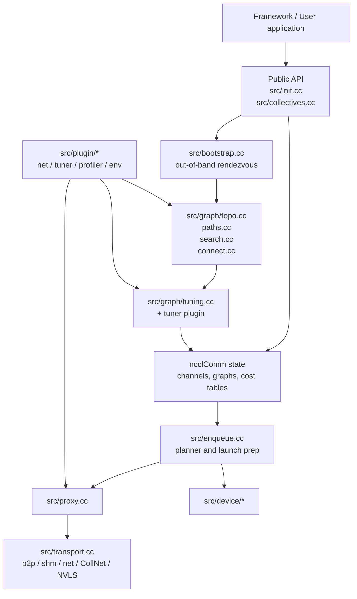
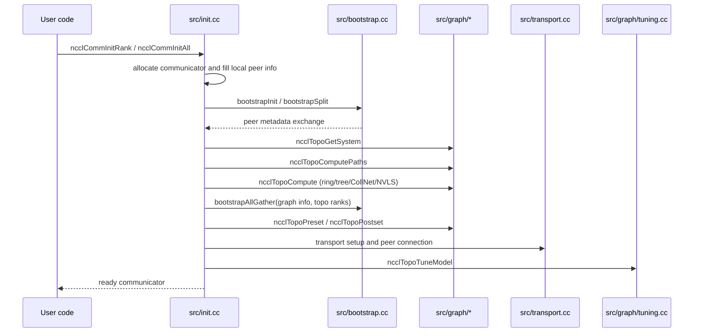
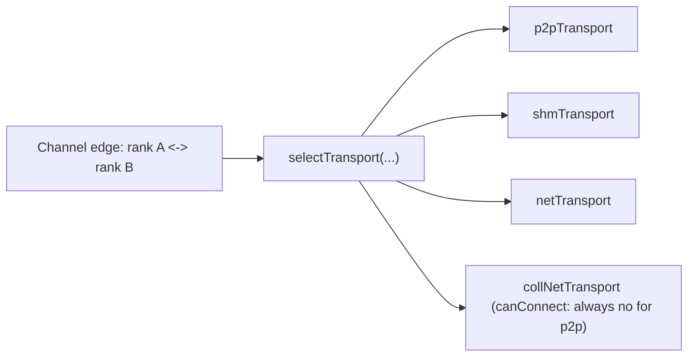

<!--
  SPDX-FileCopyrightText: Copyright (c) 2026 NVIDIA CORPORATION & AFFILIATES. All rights reserved.
  SPDX-License-Identifier: Apache-2.0

  See LICENSE.txt for more license information
-->

# NCCL Architecture: From Public API to GPU Wires

> Community contribution, not from the NCCL team. Author: tianhao909
> (<tianhaofu@foxmail.com>). Based on NCCL v2.30u1 (2.30.6). Licensed under
> Apache-2.0.

NCCL is easiest to understand as a layered runtime, not as a single CUDA
kernel. It is a distributed systems engine that happens to terminate in GPU
primitives.

## 1. The problem NCCL is solving

Multiple GPUs do not automatically behave like one giant GPU. They sit behind
PCIe switches, NVLink fabrics, NVSwitches, CPUs, NICs, NUMA links, and
sometimes multiple hosts. The fastest path for one pair of GPUs may be the
worst path for another pair.

NCCL's job is therefore twofold:

1. discover the real communication topology,
2. choose and launch a communication plan that matches that topology.

## 2. Macro architecture

## 3. What each major layer does

| Layer | Main files | Responsibility |
| --- | --- | --- |
| public API | `src/init.cc`, `src/collectives.cc` | Accept user requests and translate them into internal jobs or `ncclInfo` objects |
| bootstrap | `src/bootstrap.cc` | Exchange identity and setup metadata among ranks |
| topology engine | `src/graph/*.cc` | Build a hardware model, search candidate graphs, and instantiate channels |
| tuning model | `src/graph/tuning.cc`, `src/plugin/tuner.cc` | Estimate bandwidth and latency for every collective/algo/protocol combination |
| planner | `src/enqueue.cc` | Pick algorithm/protocol, size work units, and build launch plans |
| proxy and transport | `src/proxy.cc`, `src/transport*.cc` | Progress connections and move bytes over concrete links |
| device layer | `src/device/*` | Execute the chosen communication primitive on the GPU |

## 4. Communicator creation, end to end

The public APIs `ncclCommInitRank`, `ncclCommInitAll`, and related variants all
funnel into the async init path inside `src/init.cc`. The real work happens in
`ncclCommInitRankFunc(...)` and then `initTransportsRank(...)`.

### Why there are multiple allgathers during init

NCCL cannot decide the final channel structure from local knowledge alone.
Every rank knows its own GPU, process, host, and fabric facts first. The
bootstrap phase shares those facts so the graph and transport code can reason
about the communicator as a whole.

### Why init feels heavy

This is intentional. NCCL spends serious effort up front so that the steady
state of collective execution can be fast and mostly predictable.

### Watching init with NCCL_DEBUG_SUBSYS

Most of the decisions above are observable. Set `NCCL_DEBUG=INFO` and then narrow
the output with `NCCL_DEBUG_SUBSYS`:

| Init aspect | Useful subsystem | What it prints |
| --- | --- | --- |
| Out-of-band rendezvous | `BOOTSTRAP` | bootstrap ring setup and rank exchange |
| Topology, paths, graph search | `GRAPH` | detected hardware graph, path types, and searched ring/tree/NVLS/CollNet graphs |
| Channel and transport connection | `INIT` | high-level init progress and per-peer connection setup |
| Transport-specific detail | `NET`, `P2P`, `SHM` | the concrete transport that ends up serving an edge |
| Performance model | `TUNING` | the latency/bandwidth tables produced for each algo/protocol |
| NVLS / symmetric paths | `NVLS` | NVLS-specific setup |

For example, `NCCL_DEBUG=INFO NCCL_DEBUG_SUBSYS=GRAPH` is the fastest way to see
why a particular ring or tree was chosen, while `NCCL_DEBUG_SUBSYS=INIT` shows
how each peer edge is connected.

## 5. Channels are the backbone of runtime execution

Once topology graphs are chosen, NCCL converts them into concrete channel state.
A channel is best thought of as one independent traffic lane. If NCCL uses four
channels, it is effectively scheduling four parallel lanes of work, each with
its own peer relationships and buffers.

That is why files such as `src/graph/connect.cc` and `src/channel.cc` matter so
much: they turn the abstract graph search result into the concrete runtime state
used by the planner and device kernels.

## 6. Transport stack

At the transport layer, NCCL keeps a registry of candidate transport families in
`src/transport.cc`. The array `ncclTransports[]` holds, in order:

- P2P (`TRANSPORT_P2P`)
- SHM (`TRANSPORT_SHM`)
- NET (`TRANSPORT_NET`)
- CollNet (`TRANSPORT_COLLNET`)

There is also a profiler transport (`TRANSPORT_PROFILER`), but it lives *past* the
`NTRANSPORTS` count, so `selectTransport(...)` never asks it. The helper iterates
only the `NTRANSPORTS` entries above and asks each one whether it can connect the
current peer pair; the first transport that answers "yes" wins.

One subtlety worth clarifying: the CollNet transport's `canConnect` always answers
"no" for a normal point-to-point edge (CollNet is wired up through a separate,
collective-specific path, not through this per-edge selection). So in practice the
transports that can actually claim a peer edge here are P2P, SHM, and NET.

You can watch this selection with `NCCL_DEBUG=INFO NCCL_DEBUG_SUBSYS=INIT` (and
`NET`/`P2P`/`SHM` for transport-specific lines).

This architecture is why NCCL can adapt to radically different hardware without
changing the public API.

## 7. Plugins extend the architecture without recompiling NCCL

The loader under `src/plugin/plugin_open.cc` dynamically opens external shared
libraries for several subsystems:

- network plugins
- tuner plugins
- profiler plugins
- env plugins

This is a key architectural decision. It decouples the stable NCCL core from
site-specific networking and tuning logic. The plugin READMEs under
`plugins/net/`, `plugins/tuner/`, and `plugins/profiler/` are worth reading even
if you never write a plugin, because they clarify the boundary between "core"
and "extension".

## 8. Why proxy code exists even in a GPU library

A common beginner question is: if NCCL is about GPU communication, why is there
so much host code?

Because not every link can progress itself entirely from device code.
Connection establishment, network polling, and some registration or flush paths
still need CPU-side control. The proxy layer in `src/proxy.cc` is what keeps
those operations moving while the GPU side stays fed with work.

## 9. Source anchors worth bookmarking

- `src/init.cc`
- `src/bootstrap.cc`
- `src/graph/topo.cc`
- `src/graph/search.cc`
- `src/graph/connect.cc`
- `src/transport.cc`
- `src/plugin/plugin_open.cc`
- `src/enqueue.cc`

If you can explain how those files relate to each other, you already understand
most of NCCL's architecture.
