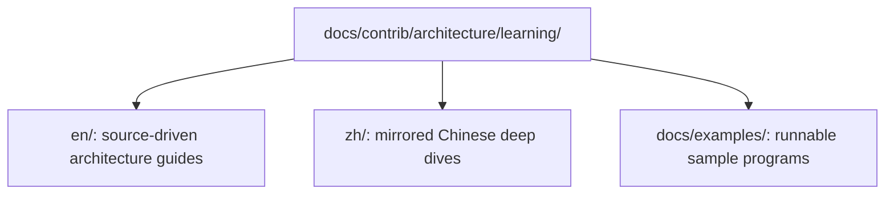

<!--
  SPDX-FileCopyrightText: Copyright (c) 2026 NVIDIA CORPORATION & AFFILIATES. All rights reserved.
  SPDX-License-Identifier: Apache-2.0

  See LICENSE.txt for more license information
-->

# NCCL Repository Learning Guides

> Community contribution, not from the NCCL team. Author: tianhao909
> (<tianhaofu@foxmail.com>). The Chinese pages under `zh/` are a translation
> of the English set. Based on NCCL v2.30u1 (2.30.6); internal names and file
> paths may drift as the code evolves. Licensed under Apache-2.0.

This directory complements the official NVIDIA documentation with
source-oriented, repository-local walkthroughs.

## Quick links

- English deep dive: [en/index.md](en/index.md)
- Chinese deep dive: [zh/index.md](zh/index.md)
- Runnable examples: [docs/examples/README.md](../../../examples/README.md)

The English track is optimized for readers who want to answer questions such as
"why did NCCL pick ring instead of tree?" or "which file should I open after
`ncclAllReduce`?". A mirrored Chinese track lives under `zh/`, so this guide
provides a bilingual learning path with the same structure in both languages.

## What is different from the official documentation?

The official user guide explains how to use NCCL as a library. This repository
track explains how the current source tree is organized and how the runtime
actually arrives at its decisions.

## Suggested starting point

1. Choose your language: [English](en/index.md) or [Chinese](zh/index.md).
2. Continue with the matching `quick-start.md` in that language directory.
3. Keep [examples](../../../examples/README.md) open for runnable reference code.
