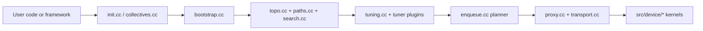

<!--
  SPDX-FileCopyrightText: Copyright (c) 2026 NVIDIA CORPORATION & AFFILIATES. All rights reserved.
  SPDX-License-Identifier: Apache-2.0

  See LICENSE.txt for more license information
-->

# NCCL Deep Dive Learning Path

If the official NCCL guide tells you which API to call, this track tells you
how NCCL thinks.

The mental model to keep in your head is simple: NCCL observes the machine,
builds communication graphs, predicts the cost of each candidate, then launches
the plan that looks cheapest for the current message size and topology.

## Why NCCL feels hard at first

- The public API is tiny, but the runtime beneath it is a full distributed
  system.
- "Algorithm" and "protocol" are different choices, and NCCL makes both.
- A single collective touches CPU threads, GPU kernels, memory registration,
  network setup, and topology heuristics.

This guide turns that stack into a readable story.

## Reading order

| Step | Document | What you get |
| --- | --- | --- |
| 1 | [quick-start.md](quick-start.md) | How to build, run examples, and open the right files first |
| 2 | [architecture.md](architecture.md) | The big picture: communicator, bootstrap, topology, planner, transport, kernels |
| 3 | [collective-execution.md](collective-execution.md) | The exact path from `ncclAllReduce` to a device work item |
| 4 | [topology-and-tuning.md](topology-and-tuning.md) | How NCCL discovers hardware and converts it into ring/tree/NVLS/CollNet graphs |
| 5 | [math-and-performance.md](math-and-performance.md) | The performance formulas, translated into plain English and small numeric examples |
| 6 | [source-code-map.md](source-code-map.md) | A file-by-file map for future code reading or hacking |

## The one-paragraph summary

NCCL is not "just a ring kernel". During communicator creation,
`src/init.cc` collects per-rank facts, `src/bootstrap.cc` exchanges them, the
graph subsystem under `src/graph/` discovers the machine and searches for
communication graphs, `src/graph/tuning.cc` turns those graphs into latency and
bandwidth estimates, and `src/enqueue.cc` later uses those estimates to choose
an algorithm and protocol for each collective. Only after those host-side
decisions are made do the device kernels under `src/device/` execute the actual
data movement and reduction.

## Fast source anchors

| File | Why it matters |
| --- | --- |
| `src/init.cc` | Public communicator APIs and the heavy init path |
| `src/bootstrap.cc` | Out-of-band rank exchange and allgathers during setup |
| `src/collectives.cc` | Thin public collective wrappers |
| `src/enqueue.cc` | Planner, cost-based selection, chunking, launch preparation |
| `src/graph/topo.cc` | Hardware graph construction |
| `src/graph/paths.cc` | Reachability and path classification |
| `src/graph/search.cc` | Ring/tree/NVLS/CollNet graph search |
| `src/graph/connect.cc` | Turn searched graphs into actual channels |
| `src/graph/tuning.cc` | Heuristic performance model |
| `src/transport.cc` and `src/transport/*` | Transport registry and implementations |
| `src/plugin/*` | Dynamic plugin loading for net/tuner/profiler/env |
| `src/device/*` | Device-side primitives and collective kernels |

## Which page should you read first?

- New to NCCL internals: start with [architecture.md](architecture.md).
- Debugging a surprising algorithm choice: start with
  [topology-and-tuning.md](topology-and-tuning.md).
- Hunting a performance issue on one collective: start with
  [collective-execution.md](collective-execution.md) and then
  [math-and-performance.md](math-and-performance.md).
- Planning a code contribution: keep [source-code-map.md](source-code-map.md)
  open the whole time.

## Scope note

These notes are source-driven and describe the code that exists in this branch.
NCCL evolves quickly, so treat function names and file paths here as anchors for
reading the code, not as a promise that every internal detail is stable forever.
