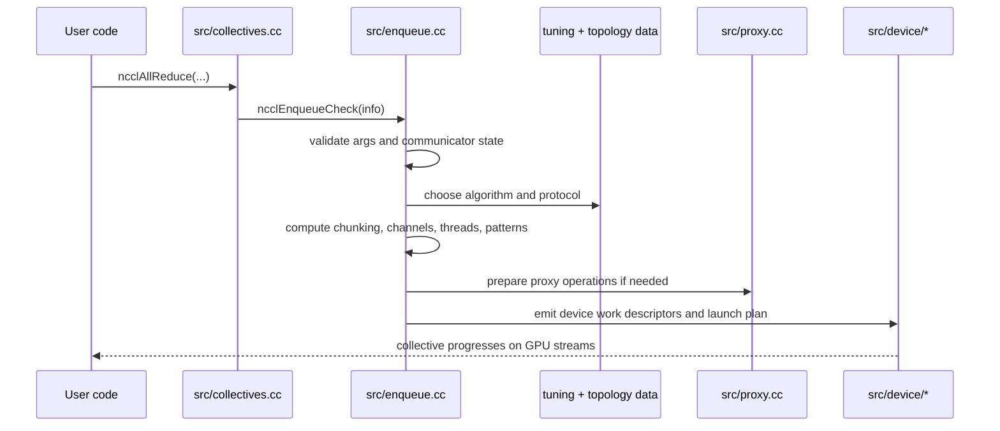
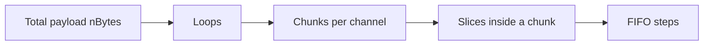

<!--
  SPDX-FileCopyrightText: Copyright (c) 2026 NVIDIA CORPORATION & AFFILIATES. All rights reserved.
  SPDX-License-Identifier: Apache-2.0

  See LICENSE.txt for more license information
-->

# Collective Execution: What Happens After `ncclAllReduce`

The public collective API looks tiny. The execution path beneath it is not.

This page follows one collective from the wrapper in `src/collectives.cc` all
the way to a device work descriptor and the transport/proxy machinery that helps
it progress.

## 1. The thin public wrapper

Functions such as `ncclAllReduce`, `ncclBroadcast`, and `ncclReduceScatter` live
in `src/collectives.cc`. Most of them do the same high-level thing:

1. populate an `ncclInfo` structure,
2. record the collective type, buffers, count, datatype, reduction op, root,
   and stream,
3. call `ncclEnqueueCheck(&info)`.

That means the real action is not in the wrapper. The wrapper is the front desk;
`enqueue.cc` is the dispatch center.

## 2. End-to-end execution path

## 3. The planner decides more than people expect

Inside `src/enqueue.cc`, NCCL does all of the following before launch:

- validates stream and communicator state,
- joins or creates group context,
- records CUDA graph capture state,
- chooses algorithm and protocol,
- chooses channel count and thread count,
- computes chunk, slice, and loop structure,
- emits proxy operations for transports that need host-side progress,
- prepares the final launch plan.

This is why `enqueue.cc` is the best single file for understanding the runtime
mindset of NCCL.

## 4. Pattern selection: the shape behind the collective

NCCL maps a `(collective, algorithm)` pair to an execution pattern. Some of the
important mappings visible in `src/enqueue.cc` are:

| Collective | Algorithm | Pattern |
| --- | --- | --- |
| all-reduce | ring | `ncclPatternRingTwice` |
| all-reduce | tree | `ncclPatternTreeUpDown` |
| all-reduce | CollNet direct | `ncclPatternCollnetDirect` |
| all-reduce | CollNet chain | `ncclPatternCollnetChain` |
| all-reduce | NVLS | `ncclPatternNvls` |
| all-reduce | NVLS tree | `ncclPatternNvlsTree` |
| all-gather | ring | `ncclPatternRing` |
| all-gather | PAT | `ncclPatternPatDown` |
| reduce-scatter | ring | `ncclPatternRing` |
| reduce-scatter | PAT | `ncclPatternPatUp` |
| broadcast | tree | `ncclPatternTreeDown` |
| reduce | tree | `ncclPatternTreeUp` |

The pattern is the bridge between a high-level algorithm name and the actual
step-by-step movement of data.

## 5. Step, slice, chunk, and loop: the part that confuses everyone

NCCL uses several nested units when it breaks work apart.

The formulas in `src/enqueue.cc` are the key anchors:

- `stepSize = buffSizes[protocol] / NCCL_STEPS`
- `chunkSize = stepSize * chunkSteps`
- `loopSize = nChannels * nchunksPerLoop * chunkSize`
- `nLoops = ceil(nBytes / loopSize)`

### Plain-English translation

Think of a vegetable market:

- the full truck order is `nBytes`,
- each traffic lane is one channel,
- each truck load is a chunk,
- each crate on the truck is a slice,
- each loading dock slot is a step.

NCCL is deciding how many lanes to open, how large to make each truck load, and
how many trips are needed.

### Tiny numeric example

Suppose:

- `nBytes = 256 MiB`
- `nChannels = 4`
- `nchunksPerLoop = 8`
- `chunkSize = 1 MiB`

Then:

- `loopSize = 4 * 8 * 1 MiB = 32 MiB`
- `nLoops = ceil(256 / 32) = 8`

So NCCL needs eight loop rounds to drain the full payload.

## 6. Cost-based algorithm and protocol selection

The helper usually discussed first is `topoGetAlgoInfo(...)` in `src/enqueue.cc`.
Its job is to look at the cost table already prepared by the topology and tuning
subsystem and pick the cheapest candidate for the current collective.

This is an important inversion of perspective:

- `graph/tuning.cc` does not launch anything,
- `enqueue.cc` does not discover hardware,
- but `enqueue.cc` trusts the model from `graph/tuning.cc` to make the launch
  decision.

## 7. CUDA graph capture is handled deliberately

The planner tracks whether streams are part of a CUDA graph capture. The helper
`ncclPlannerSetCapturingGraph(...)` enforces that streams in a grouped NCCL
operation are either all uncaptured or all captured by the same graph. That is
why grouped collectives can fail with an invalid-usage error if graph-capture
context is inconsistent.

## 8. Reduction operators: average is a good example of hidden subtlety

The helper `hostToDevRedOp(...)` in `src/enqueue.cc` reveals a nice design idea:
for averages, the network and device side often reuse sum-oriented machinery.
For integer types, NCCL can represent average as "sum first, divide later". For
floating-point types, it can also represent average as "multiply by `1/nRanks`
first, then sum".

That may sound abstract, but it is just this everyday arithmetic:

- average of 8 numbers = `(x1 + x2 + ... + x8) / 8`
- which is equivalent to `(x1/8) + (x2/8) + ... + (x8/8)`

NCCL chooses whichever representation fits the datatype and kernel machinery
best.

## 9. Device execution is the last step, not the first step

Once host-side planning is done, the device layer under `src/device/` executes
that plan. The most valuable files to inspect are:

- `src/device/primitives.h`
- `src/device/prims_ll.h`
- `src/device/prims_ll128.h`
- `src/device/prims_simple.h`
- `src/device/all_reduce.h`
- `src/device/all_gather.h`
- `src/device/reduce_scatter.h`

A useful reading strategy is:

1. read the host-side pattern choice in `enqueue.cc`,
2. then open the device file for that collective,
3. then inspect the primitive implementation for the chosen protocol.

That keeps the mental stack small.
