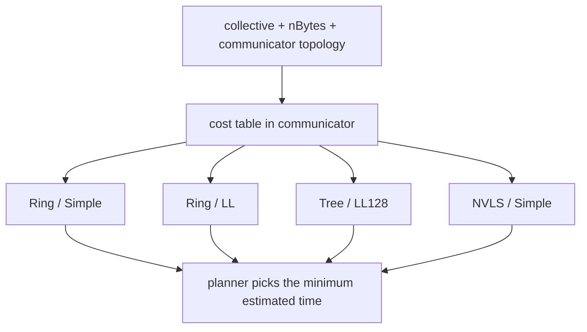
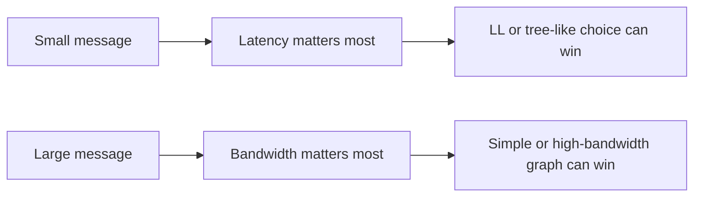

<!--
  SPDX-FileCopyrightText: Copyright (c) 2026 NVIDIA CORPORATION & AFFILIATES. All rights reserved.
  SPDX-License-Identifier: Apache-2.0

  See LICENSE.txt for more license information
-->

\
# Math and Performance: Translating NCCL's Formulas Into Intuition

This is the "do not panic" page.

NCCL's performance model looks intimidating because it mixes topology, channel
counts, protocol caps, and latency formulas. Under the surface, most of it is
still the same old idea:

> estimated time = startup cost + moving-bytes cost

## 1. The decision picture

NCCL stores these estimates in communicator tables such as `bandwidths[...]`
and `latencies[...]`, then `src/enqueue.cc` asks for the cheapest option.

## 2. The master equation to keep in mind

A practical mental approximation is:

$$
\text{estimated time} \approx \text{latency} + \frac{\text{bytes}}{\text{effective bandwidth}}
$$

### What each symbol means in real life

| Symbol | Real meaning |
| --- | --- |
| latency | how much fixed startup and per-step delay you pay even before the message gets large |
| bytes | how much payload the collective must move |
| effective bandwidth | the bandwidth after NCCL accounts for topology, channels, protocol overhead, and algorithm structure |

If you remember only one formula from this page, remember this one.

## 3. Formula 1: bus bandwidth

A core formula in `src/graph/tuning.cc` is:

$$
\text{busBw} = \text{nChannels} \times bw
$$

### Meaning

- `bw` is the per-channel bandwidth the topology graph thinks is realistic.
- `nChannels` is how many parallel lanes NCCL uses.
- `busBw` is the total raw bandwidth NCCL thinks it can put on the fabric.

### Tiny example

Suppose each channel can sustain `25 GB/s` and NCCL uses `4` channels.

$$
\text{busBw} = 4 \times 25 = 100\,GB/s
$$

So NCCL begins with the idea that the machine can push about `100 GB/s` of raw
traffic for that candidate.

## 4. Formula 2: ring all-reduce effective bandwidth

For ring-style paths, the model later scales bandwidth roughly by the ratio
between useful work and total ring steps.

For all-reduce, NCCL models:

$$
\text{nsteps} = 2 \times (nRanks - 1)
$$

and applies a ratio proportional to:

$$
\frac{nRanks}{nsteps}
$$

### Plain-English meaning

In a ring all-reduce, data does not teleport from every GPU to every GPU in one
move. It circulates around the ring in multiple steps, so not every byte moved
is immediately useful output at the destination. The ratio discounts raw fabric
bandwidth into useful algorithm bandwidth.

### Tiny example

With `8` ranks:

$$
\text{nsteps} = 2 \times (8-1) = 14
$$

If the raw `busBw` estimate is `100 GB/s`, the useful ring bandwidth becomes
roughly:

$$
100 \times \frac{8}{14} \approx 57.1\,GB/s
$$

If the payload is `1 GB`, the bandwidth-dominated part of time is about:

$$
1 / 57.1 \approx 0.0175\,s = 17.5\,ms
$$

plus startup latency.

That is the kind of arithmetic the model is trying to approximate.

## 5. Formula 3: tree all-reduce latency

For tree all-reduce, `src/graph/tuning.cc` uses a latency expression of the form:

$$
2 \times \left((nRanks/nNodes - 1) \times intraLat + \log_2(nNodes) \times interLat\right)
$$

### Meaning

- `intraLat` is the local, within-node latency cost.
- `interLat` is the cross-node latency cost.
- `nRanks/nNodes - 1` is "how many local peers do I need to fold in?"
- `log2(nNodes)` is the depth of the inter-node tree.
- the leading `2` comes from the up-and-down phases of all-reduce.

### Tiny example

Suppose:

- `8` ranks over `2` nodes,
- `4` ranks per node,
- `intraLat = 0.8 us`,
- `interLat = 3.0 us`.

Then:

$$
2 \times ((4-1) \times 0.8 + \log_2(2) \times 3.0)
= 2 \times (2.4 + 3.0)
= 10.8\,us
$$

That is why tree-like algorithms often look attractive for small messages: the
latency model can dominate before bandwidth becomes the main story.

## 6. Protocol intuition: Simple, LL, and LL128

You can think of NCCL protocols as different delivery vehicles.

| Protocol | Everyday analogy | Typical intuition |
| --- | --- | --- |
| Simple | large truck | highest peak throughput for large payloads |
| LL | small courier bike | great when startup time matters more than payload size |
| LL128 | optimized van | a middle ground with better packing than LL and less overhead than Simple in some regimes |

This is an intuition aid, not a rule carved in stone. NCCL still uses the full
cost table, not a one-line heuristic.

## 7. Average reduction is just arithmetic wearing systems clothes

The helper `hostToDevRedOp(...)` shows that `avg` is represented differently for
different datatypes.

At the math level, there is nothing mysterious:

$$
\mathrm{avg}(x_1, ..., x_n) = \frac{x_1 + ... + x_n}{n}
$$

For floating-point types, NCCL can encode this as a pre-multiply plus sum:

$$
\frac{x_1}{n} + \frac{x_2}{n} + ... + \frac{x_n}{n}
$$

For integer types, it can instead treat the network-visible operation as sum and
apply division semantics afterward. Same math, different systems-friendly
representation.

## 8. Tuner plugins change preferences, not mathematics

The tuner plugin interface described in `plugins/tuner/README.md` can modify the
cost table directly.

That means:

- NCCL's default model is a strong heuristic,
- but it is intentionally not the only truth,
- large deployments can override the preference order when they know better.

A good way to say this precisely is:

> NCCL's model is a policy engine backed by formulas, not a universal theorem.

## 9. Why the model has many correction factors

You will see constants like `.92`, `.85`, `1/3.8`, or `120/128` in
`src/graph/tuning.cc`.

Do not read them as abstract beauty. Read them as engineering memory. They are
compressed knowledge about protocol packing efficiency, hardware caps, and
empirical penalties discovered on real platforms.

## 10. The farmer-and-truck analogy

Suppose eight farmers must send potatoes to every other farmer.

- More roads open at once means more channels.
- Better roads mean higher per-channel `bw`.
- Ring means each truck visits many farmers before finishing.
- Tree means potatoes climb up a collection tree and then flow back down.
- Small potato bags care more about toll booth delay than highway width.
- Giant potato shipments care much more about highway width than booth delay.

That is almost the whole NCCL model in village language.

## 11. The source files that matter most here

- `src/graph/tuning.cc`
- `src/enqueue.cc`
- `src/include/comm.h`
- `plugins/tuner/README.md`
