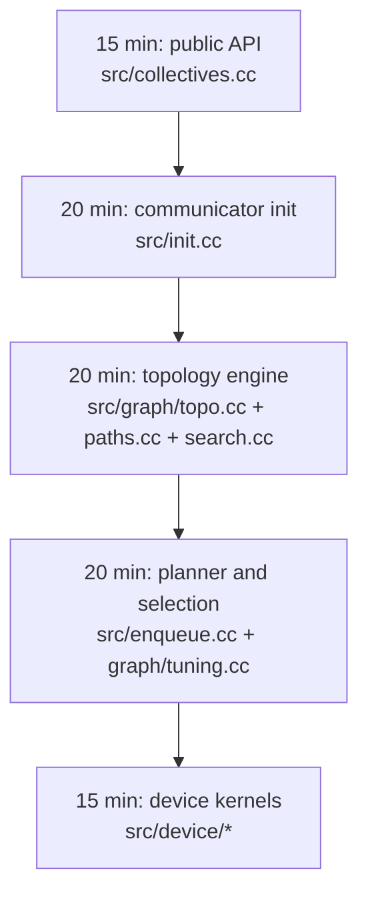

<!--
  SPDX-FileCopyrightText: Copyright (c) 2026 NVIDIA CORPORATION & AFFILIATES. All rights reserved.
  SPDX-License-Identifier: Apache-2.0

  See LICENSE.txt for more license information
-->

# Quick Start for Reading NCCL Like a Systems Engineer

Before you dive into the deep internals, get three practical handles:

1. build the library,
2. run the examples,
3. learn which file corresponds to which runtime stage.

That alone removes a surprising amount of fear.

## Why this matters

Many engineers first meet NCCL during a painful moment: eight expensive GPUs
are present, but throughput is worse than expected, latency spikes on small
messages, or a collective picks a surprising path. The fastest way to recover
is to connect the public API to the actual source files that make the decision.

## 1. Build the library

From the repository root:

```bash
make -j src.build
```

If CUDA is not installed under `/usr/local/cuda`, use:

```bash
make -j src.build CUDA_HOME=<path-to-cuda>
```

To build the repository examples as well:

```bash
make -j examples
```

To build the examples with MPI support:

```bash
make -j examples MPI=1
```

If NCCL is already built and you only want the examples:

```bash
cd docs/examples
make NCCL_HOME=<path-to-nccl> [MPI=1]
```

These commands come directly from the repository's `README.md` and
`docs/examples/README.md`.

## 2. Start with runnable examples, not abstract theory

The best minimal paths are:

- `docs/examples/01_communicators/`: how communicators are created and torn down
- `docs/examples/03_collectives/01_allreduce/`: the smallest end-to-end
  collective example
- `docs/examples/06_device_api/`: newer device-side communication examples

If you want end-to-end performance validation rather than teaching samples, use
`nccl-tests`, which the root `README.md` points to as the external benchmark
repository.

## 3. Turn on x-ray vision with logs

When you run an application, these settings are often the fastest way to see
what NCCL is deciding:

```bash
NCCL_DEBUG=INFO NCCL_DEBUG_SUBSYS=INIT,GRAPH,TUNING,NET ./your_program
```

Practical reading rule:

- `INIT` tells you how the communicator came up.
- `GRAPH` tells you what hardware and graph search concluded.
- `TUNING` tells you the cost-model view of the world.
- `NET` tells you which network path or plugin was used.

## 4. A 90-minute source tour



### Step A: public API

Open `src/collectives.cc`. The first surprise is that the public collective
functions are intentionally thin. Most wrappers just populate an `ncclInfo`
object and call `ncclEnqueueCheck(...)`.

### Step B: communicator init

Open `src/init.cc`. This is where `ncclCommInitRank`, `ncclCommInitAll`, and
`ncclCommSplit` fan into the heavy setup path. The center of gravity is
`ncclCommInitRankFunc(...)` plus `initTransportsRank(...)`.

### Step C: topology engine

Open `src/graph/topo.cc`, `src/graph/paths.cc`, and `src/graph/search.cc`.
These files answer the question: "what machine am I running on, and which ring,
tree, CollNet, or NVLS graph should I build on top of it?"

### Step D: planner and selection

Open `src/enqueue.cc` and `src/graph/tuning.cc`. Here NCCL turns topology data
into a cost table, then chooses algorithm, protocol, channels, chunk sizes, and
thread counts.

### Step E: device kernels

Open `src/device/primitives.h` and one collective header such as
`src/device/all_reduce.h`. This is where the chosen plan finally becomes GPU
work.

## 5. Vocabulary that unlocks the code

| Term | Plain-English meaning |
| --- | --- |
| communicator | The runtime state shared by all ranks participating in communication |
| channel | One parallel lane of data movement; more channels usually means more parallel traffic |
| algorithm | The high-level data movement shape, such as ring, tree, PAT, CollNet, or NVLS |
| protocol | The low-level transfer style, such as Simple, LL, or LL128 |
| transport | The concrete way two peers connect, such as P2P, SHM, or NET |
| proxy | Host-side progress logic for connections that need CPU participation |
| topology graph | NCCL's compressed view of GPUs, CPUs, NICs, switches, and links |

## 6. Three practical reading loops

### "How does a communicator come alive?"

Read `src/init.cc` -> `src/bootstrap.cc` -> `src/graph/connect.cc`.

### "Why did NCCL pick ring on this workload?"

Read `src/graph/tuning.cc` -> `src/enqueue.cc` ->
`tuning plugin docs under plugins/tuner/README.md`.

### "Why is inter-node traffic slow?"

Read `src/transport.cc` -> `src/transport/net.cc` -> `src/plugin/net.cc` ->
`plugins/net/README.md`.

## 7. A good first mental model

Think of NCCL as a logistics company.

- The application places an order.
- The communicator is the shipping network contract.
- The topology engine draws the road map.
- The tuning model estimates travel time on every route.
- The planner chooses trucks, package size, and dispatch lanes.
- The GPU kernels are the actual workers moving boxes.

Once that picture is clear, the source tree stops feeling like a maze.
