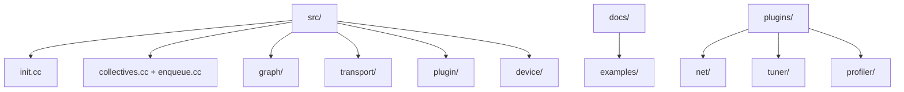

<!--
  SPDX-FileCopyrightText: Copyright (c) 2026 NVIDIA CORPORATION & AFFILIATES. All rights reserved.
  SPDX-License-Identifier: Apache-2.0

  See LICENSE.txt for more license information
-->

# Source Code Map: Where to Read, Depending on the Question

This page is a reading map, not a narrative. Keep it open while you browse the
repository.

## 1. Directory-level map



## 2. If you ask question X, open file Y first

| Question | First file | Then read | Why |
| --- | --- | --- | --- |
| How does `ncclCommInitRank` work? | `src/init.cc` | `src/bootstrap.cc` | init fans into bootstrap and transport setup |
| Where are collectives exposed to users? | `src/collectives.cc` | `src/enqueue.cc` | wrappers are thin and planner is the real engine |
| Why did NCCL choose ring/tree/NVLS? | `src/graph/tuning.cc` | `src/enqueue.cc` | tuning builds the score, enqueue consumes it |
| How is the machine topology discovered? | `src/graph/topo.cc` | `src/graph/paths.cc` | graph construction happens before search |
| How are graphs searched? | `src/graph/search.cc` | `src/graph/connect.cc` | search decides candidates, connect makes channels real |
| Where are ring/tree neighbors stored? | `src/graph/connect.cc` | `src/include/comm.h` | connection synthesis populates communicator state |
| How is transport picked? | `src/transport.cc` | `src/transport/p2p.cc`, `src/transport/net.cc` | the registry and concrete transport logic live here |
| How do network plugins load? | `src/plugin/plugin_open.cc` | `src/plugin/net.cc` | generic loader plus network-specific probing |
| How do tuner plugins load? | `src/plugin/tuner.cc` | `plugins/tuner/README.md` | shows the core/plugin boundary |
| Where is proxy progress handled? | `src/proxy.cc` | `src/transport/*` | proxy and transport progress are tightly coupled |
| Where are device primitives defined? | `src/device/primitives.h` | `src/device/prims_*.h` | protocol-specific device behavior lives there |
| Where do I learn the device header layering? | `src/include/nccl_device/README.md` | `src/include/nccl_device/*.h` | explains the human-facing vs impl layering |

## 3. Study plans by time budget

### 30 minutes

- `src/collectives.cc`
- `src/enqueue.cc` around `ncclEnqueueCheck(...)`
- `src/graph/tuning.cc`

Goal: understand that NCCL is a cost-based planner, not a fixed kernel.

### 2 hours

- `src/init.cc`
- `src/bootstrap.cc`
- `src/graph/topo.cc`
- `src/graph/search.cc`
- `src/graph/connect.cc`
- `src/enqueue.cc`

Goal: understand the full host-side control path.

### 1 day

Add:

- `src/transport.cc` and `src/transport/*`
- `src/proxy.cc`
- `src/device/primitives.h`
- one device collective header such as `src/device/all_reduce.h`
- plugin READMEs under `plugins/`

Goal: understand why performance behavior changes across machines.

## 4. Good search commands when exploring locally

From the repository root:

```bash
rg "ncclCommInitRank" src/init.cc
rg "ncclEnqueueCheck|topoGetAlgoInfo" src/enqueue.cc
rg "ncclTopoCompute|ncclTopoTuneModel" src/graph
rg "selectTransport|ncclTransports" src/transport.cc src/transport
rg "ncclTunerPluginLoad|ncclOpen.*PluginLib" src/plugin
```

Those patterns line up well with the architecture explained in the rest of this
documentation set.

## 5. Existing docs already worth reading in this repo

| File | Why it is useful |
| --- | --- |
| `docs/examples/README.md` | runnable examples and build knobs |
| `plugins/net/README.md` | best explanation of the NET plugin boundary |
| `plugins/tuner/README.md` | explains how cost tables can be overridden |
| `plugins/profiler/README.md` | shows how NCCL exposes internal runtime events |
| `src/include/nccl_device/README.md` | explains how device headers are layered for readability |

## 6. One final reading trick

Whenever a file feels too abstract, ask one of these three grounding questions:

1. What runtime decision is this file making?
2. What data structure carries that decision into the next stage?
3. Which later file consumes that structure?

That habit turns the NCCL source tree from a large pile of files into a chain of
cause and effect.
