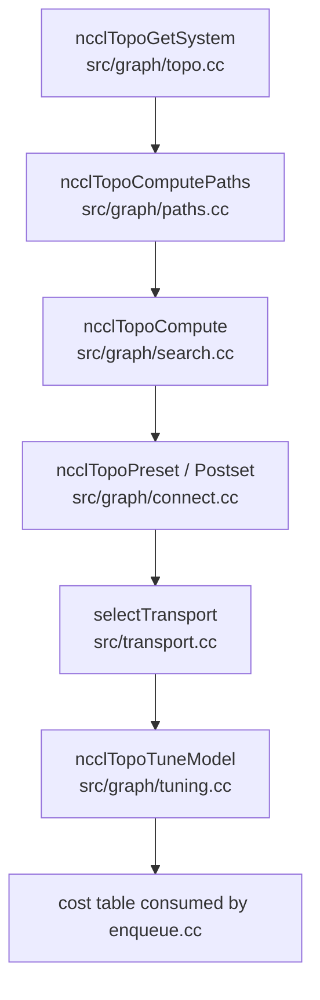

<!--
  SPDX-FileCopyrightText: Copyright (c) 2026 NVIDIA CORPORATION & AFFILIATES. All rights reserved.
  SPDX-License-Identifier: Apache-2.0

  See LICENSE.txt for more license information
-->

# Topology and Tuning: How NCCL Turns Hardware Into Decisions

Hardware is destiny in NCCL.

A ring that is perfect on an NVLink island may be mediocre across PCIe, and a
protocol that shines for 1 KiB messages may be terrible for 1 GiB messages.
This page explains how NCCL models the machine and converts that model into a
choice.

## 1. The pipeline from metal to model



## 2. `ncclTopoGetSystem`: build a graph of the machine

`src/graph/topo.cc` constructs NCCL's internal graph of GPUs, CPUs, NICs,
PCIe switches, NVSwitches, and links between them. It is not just collecting
labels; it is building the graph that later search and tuning logic will use.

This file also contains several pieces of hardware-specific cleanup logic, such
as flattening PCIe switch hierarchies that would otherwise mislead the search.
That is a good reminder that topology discovery is never purely theoretical: it
must survive real hardware quirks.

## 3. `ncclTopoComputePaths`: classify how things can reach each other

After the raw graph exists, `src/graph/paths.cc` computes path classes and
reachability between important endpoints such as GPU-to-GPU and GPU-to-NIC.

A rough mental model for common path classes is:

| Path type | Intuition |
| --- | --- |
| `LOC` | same location, essentially no fabric travel |
| `NVL` | direct NVLink |
| `NVB` | NVLink through a switch or bridge |
| `C2C` | chip-to-chip style direct coherent link |
| `PIX` | same PCIe switch |
| `PXB` | across multiple PCIe switches |
| `P2C` | path involving a CPU/root-complex crossing |
| `PXN` | proxy-network style detour through a neighbor GPU/NIC relationship |
| `PHB` | across a host bridge |
| `SYS` | across a wider system/NUMA link |
| `NET` | across the network |

You do not need to memorize every label. The practical point is simpler: NCCL
converts messy hardware into ordered path classes that the rest of the runtime
can compare.

## 4. `ncclTopoCompute`: search for communication graphs

The heavy graph search logic lives in `src/graph/search.cc`. It searches for
candidate ring, tree, CollNet, and NVLS graphs under constraints such as:

- intra-node and inter-node bandwidth,
- allowed path type,
- channel count,
- cross-NIC policy,
- whether channels should be replayed or diversified,
- search timeout budget.

This is not a shortest-path algorithm in the textbook sense. It is a
communication-graph search tailored to collective algorithms.

### Why this matters

NCCL is not merely asking "can rank A reach rank B?". It is asking a much more
valuable systems question:

> What multi-lane communication skeleton should all ranks share so that the
> collective is fast as a whole?

## 5. Search patterns are different from algorithms

A useful distinction:

- an **algorithm** is the high-level collective strategy,
- a **pattern** is the concrete traversal shape used by the implementation.

For example, ring and tree are both algorithms, but `src/enqueue.cc` later maps
them to patterns such as `ncclPatternRingTwice` or `ncclPatternTreeUpDown`.
The graph search layer prepares the topology backbone those patterns rely on.

## 6. `ncclTopoPreset` and `ncclTopoPostset`: make channels real

Once search produces graphs, `src/graph/connect.cc` turns them into real channel
relationships.

`ncclTopoPreset(...)` initializes per-rank local role information, such as ring
neighbors, tree parent/children, CollNet heads, and NVLS heads.

`ncclTopoPostset(...)` then merges all-rank graph information into the final
communicator channel layout.

This split is worth remembering:

- **search** decides the graph,
- **connect** decides how each rank actually lives inside that graph.

## 7. Transport selection is topology-aware

After channels are known, NCCL still has to pick a concrete transport for each
edge.

```mermaid
flowchart LR
    Pair[peer pair + channel + connection index] --> Select[selectTransport(...)]
    Select --> P2P[p2pTransport]
    Select --> SHM[shmTransport]
    Select --> NET[netTransport]
    Select --> CN[collNetTransport]
```

The order in `src/transport.cc` matters because `selectTransport(...)` asks each
transport whether it can connect and stops at the first viable answer.

That design gives NCCL a clean policy boundary:

- topology says what structure we want,
- transport says how each edge is implemented.

## 8. `ncclTopoTuneModel`: convert topology into time estimates

The performance model in `src/graph/tuning.cc` takes the searched graphs and
builds tables of predicted latency and bandwidth for every combination of:

- collective function,
- algorithm,
- protocol.

The outputs are stored inside the communicator, then consumed by `enqueue.cc`
when a real collective arrives.

In other words, the tuning model is NCCL's internal answer to this question:

> Given this communicator topology and this message size, which option should be
> fastest?

## 9. Tuner plugins can rewrite the final preference table

The loader in `src/plugin/tuner.cc` can dynamically load an external tuner
plugin via `NCCL_TUNER_PLUGIN`. That plugin can modify the cost table before the
planner picks an option.

This is extremely important for large deployments. It means a site can adapt
NCCL's preferences to its hardware or workload without recompiling the NCCL core.

The best companion doc here is `plugins/tuner/README.md`.

## 10. The simplest possible intuition

Imagine you are organizing deliveries for a city with bikes, vans, trucks,
bridges, tunnels, and ferries.

- topology discovery draws the city map,
- path computation annotates which roads are wide or narrow,
- graph search chooses a delivery pattern for all neighborhoods,
- transport selection chooses the actual vehicle for each road,
- tuning estimates travel time,
- enqueue later dispatches the cheapest plan for the current order size.

That is NCCL's topology-and-tuning stack in one picture.

## 11. Best source anchors

- `src/graph/topo.cc`
- `src/graph/paths.cc`
- `src/graph/search.cc`
- `src/graph/connect.cc`
- `src/graph/tuning.cc`
- `src/transport.cc`
- `src/plugin/tuner.cc`
- `plugins/tuner/README.md`
