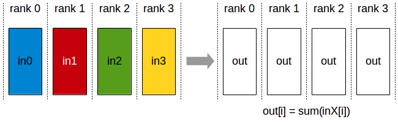
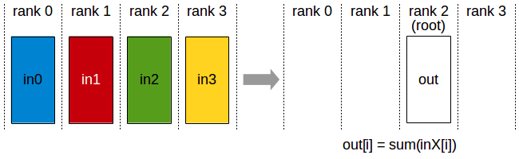
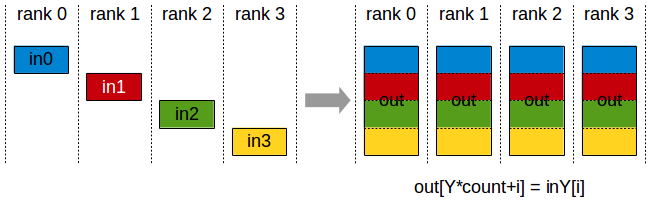
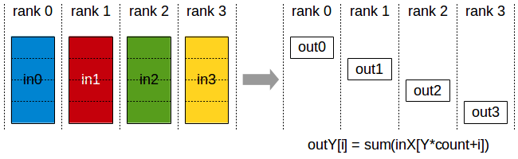
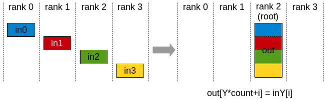
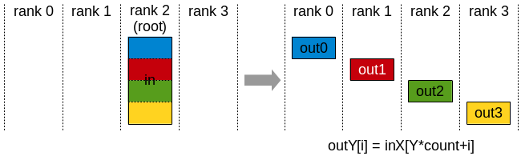

*********************
Collective Operations
*********************

Collective operations have to be called for each rank (hence CUDA device), using the same count and the same datatype, to form a complete collective operation.
Failure to do so will result in undefined behavior, including hangs, crashes, or data corruption.

.. _allreduce:

AllReduce
---------

The AllReduce operation performs reductions on data (for example, sum, min, max) across devices and stores the result in the receive buffer of every rank.

In a *sum* allreduce operation between *k* ranks, each rank will provide an array in of N values, and receive identical results in array out of N values,
where out[i] = in0[i]+in1[i]+…+in(k-1)[i].

 All-Reduce operation: each rank receives the reduction of input values across ranks.

Related links: :c:func:`ncclAllReduce`.

.. _broadcast:

Broadcast
---------

The Broadcast operation copies an N-element buffer from the root rank to all the ranks.

.. figure:: images/broadcast.png
 :align: center

 Broadcast operation: all ranks receive data from a “root” rank.

Important note: The root argument is one of the ranks, not a device number, and is therefore impacted by a different rank to device mapping.

Related links: :c:func:`ncclBroadcast`.

.. _reduce:

Reduce
------

The Reduce operation performs the same operation as AllReduce, but stores the result only in the receive buffer of a specified root rank.

 Reduce operation: one rank receives the reduction of input values across ranks.

Important note: The root argument is one of the ranks (not a device number), and is therefore impacted by a different rank to device mapping.

Note: A Reduce, followed by a Broadcast, is equivalent to the AllReduce operation.

Related links: :c:func:`ncclReduce`.

.. _allgather:

AllGather
---------

The AllGather operation gathers N values from k ranks into an output buffer of size k*N, and distributes that result to all ranks.

The output is ordered by the rank index. The AllGather operation is therefore impacted by a different rank to device mapping.

 AllGather operation: each rank receives the aggregation of data from all ranks in the order of the ranks.

Note: Executing ReduceScatter, followed by AllGather, is equivalent to the AllReduce operation.

Related links: :c:func:`ncclAllGather`.

.. _reducescatter:

ReduceScatter
-------------

The ReduceScatter operation performs the same operation as Reduce, except that the result is scattered in equal-sized blocks between ranks,
each rank getting a chunk of data based on its rank index.

The ReduceScatter operation is impacted by a different rank to device mapping since the ranks determine the data layout.

 Reduce-Scatter operation: input values are reduced across ranks, with each rank receiving a subpart of the result.

Related links: :c:func:`ncclReduceScatter`

.. _alltoall:

AlltoAll
--------

In an AlltoAll operation between k ranks, each rank provides an input buffer of size k*N values, where the j-th chunk of N values is sent to destination rank j. Each rank receives an output buffer of size k*N values, where the i-th chunk of N values comes from source rank i.

.. figure:: images/alltoall.png
 :align: center

 AlltoAll operation: exchanges data between all ranks, where each rank sends different data to every other rank and receives different data from every other rank.

Related links: :c:func:`ncclAlltoAll`.

.. _gather:

Gather
------

The Gather operation gathers N values from k ranks into an output buffer on the root rank of size k*N.

 Gather operation: root rank receives data from all ranks.

Important note: The root argument is one of the ranks, not a device number, and is therefore impacted by a different rank to device mapping.

Related links: :c:func:`ncclGather`.

.. _scatter:

Scatter
-------

The Scatter operation distributes a total of N*k values from the root rank to k ranks, each rank receiving N values.

 Scatter operation: root rank distributes data to all ranks.

Important note: The root argument is one of the ranks, not a device number, and is therefore impacted by a different rank to device mapping.

Related links: :c:func:`ncclScatter`.
