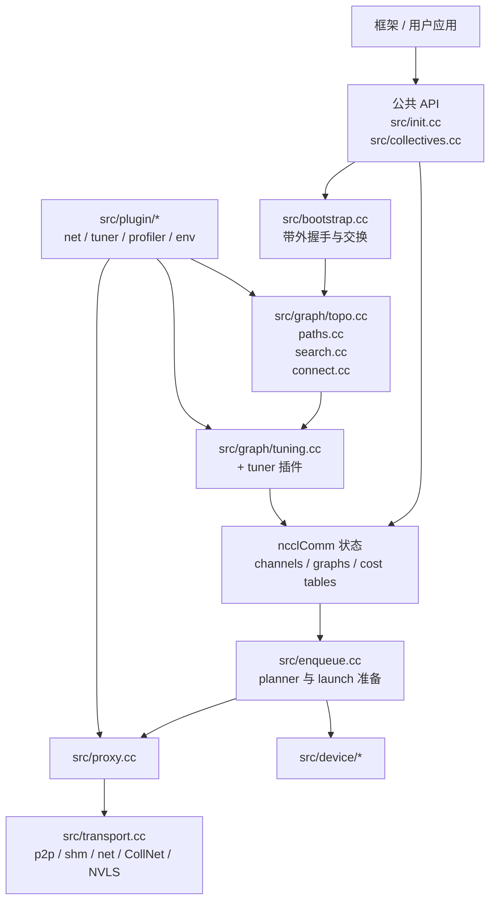
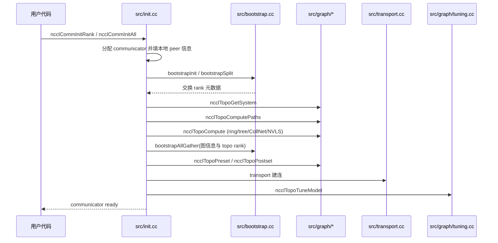

<!--
  SPDX-FileCopyrightText: Copyright (c) 2026 NVIDIA CORPORATION & AFFILIATES. All rights reserved.
  SPDX-License-Identifier: Apache-2.0

  See LICENSE.txt for more license information
-->

# NCCL 架构总览：从公共 API 一路走到 GPU 链路

理解 NCCL 最好的方式，不是把它看成“一个 CUDA kernel”，而是把它看成
“以 GPU kernel 为终点的一套分层运行时系统”。

## 1. NCCL 真正要解决的问题是什么

多张 GPU 并不会天然组成一块“超级 GPU”。它们可能隔着 PCIe 交换机、
NVLink、NVSwitch、CPU、NIC、NUMA 链路，甚至多台机器。

对某两张卡来说最好的路径，对另外两张卡来说可能恰恰最差。

所以 NCCL 的核心任务其实有两件：

1. 认清当前机器和集群的真实通信拓扑；
2. 针对这个拓扑，为当前 collective 选出最合适的执行方案。

## 2. 宏观架构图



## 3. 每一层到底在干嘛

| 层次 | 核心文件 | 职责 |
| --- | --- | --- |
| public API | `src/init.cc`, `src/collectives.cc` | 接住用户请求，转成内部作业或 `ncclInfo` |
| bootstrap | `src/bootstrap.cc` | rank 间带外交换初始化元数据 |
| topology engine | `src/graph/*.cc` | 构造硬件图、搜索候选通信图、落成 channels |
| tuning model | `src/graph/tuning.cc`, `src/plugin/tuner.cc` | 为每种 collective/算法/协议估算带宽与延迟 |
| planner | `src/enqueue.cc` | 选算法、选协议、切 chunk、生成 launch plan |
| proxy 与 transport | `src/proxy.cc`, `src/transport*.cc` | 推进连接与跨链路数据传输 |
| device layer | `src/device/*` | 在 GPU 上执行最终通信 primitive |

## 4. communicator 是怎样被创建出来的

`ncclCommInitRank`、`ncclCommInitAll` 等 public API 都会汇入
`src/init.cc` 中的异步初始化路径。真正的主干是
`ncclCommInitRankFunc(...)`，以及内部的大块逻辑 `initTransportsRank(...)`。



### 为什么初始化阶段要做多轮 allgather

因为只靠“我自己这张卡知道的信息”远远不够。每个 rank 一开始只能知道
自己的 GPU、进程、主机、fabric 等局部事实；只有通过 bootstrap 把这些
事实广播出去，NCCL 才能从“局部视角”拼出“整个 communicator 的全局视
角”。

### 为什么 init 会显得很重

因为这是典型的“前面多花功夫，后面持续收益”的系统设计。NCCL 宁可在
communicator 创建时做大量工作，也要换来后续 collective 的快速和稳定。

## 5. channel 是运行时骨架

一旦拓扑图选定，NCCL 就会把它们转成具体 channel 状态。你可以把 channel
理解成“一条独立的数据高速车道”。如果 NCCL 使用 4 个 channels，本质上就
是在组织 4 条并行车道共同搬数据。

因此 `src/graph/connect.cc` 和 `src/channel.cc` 这类文件特别关键：它们把
“抽象的图搜索结果”变成了“真实可执行的运行时结构”。

## 6. transport 栈

在 `src/transport.cc` 中，NCCL 维护了一张 transport 候选表：

- P2P
- SHM
- NET
- CollNet
- profiler transport helper

选择逻辑 `selectTransport(...)` 会按顺序询问每一种 transport：“你能接这
个 peer pair 吗？”谁先能接上，谁就赢。

```mermaid
flowchart LR
    Edge[channel 边: rank A <-> rank B] --> Select[selectTransport(...)]
    Select --> P2P[p2pTransport]
    Select --> SHM[shmTransport]
    Select --> NET[netTransport]
    Select --> CN[collNetTransport]
```

这就是为什么 NCCL 能在完全不同的硬件上保持同一套外部 API：变化被吸收
在 transport 和 topology 这两层里了。

## 7. 插件机制：不重编 NCCL 也能扩展能力

`src/plugin/plugin_open.cc` 负责动态打开外部共享库，支持：

- network plugin
- tuner plugin
- profiler plugin
- env plugin

这是一个极其关键的架构决策：NCCL 核心保持稳定，而网络、调优策略和观测
能力则可以按站点需求扩展。

就算你永远不写插件，也非常建议读一遍 `plugins/net/README.md`、
`plugins/tuner/README.md` 和 `plugins/profiler/README.md`，因为它们清楚划分
了“核心做什么”和“扩展能做什么”。

## 8. 为什么一个 GPU 通信库里会有那么多 host 代码

新手常问：NCCL 明明是 GPU 通信库，为什么还有这么多 CPU 端逻辑？

答案很简单：

- 不是所有链路都能纯靠 device code 自己推进；
- 建连、网络轮询、内存注册、flush 等很多环节仍然需要 CPU 参与。

`src/proxy.cc` 就是这层“宿主侧推进器”，负责让那些需要 CPU 协作的操作稳
定前进，不让 GPU 侧断粮。

## 9. 真正值得收藏的源码锚点

- `src/init.cc`
- `src/bootstrap.cc`
- `src/graph/topo.cc`
- `src/graph/search.cc`
- `src/graph/connect.cc`
- `src/transport.cc`
- `src/plugin/plugin_open.cc`
- `src/enqueue.cc`

如果你已经能讲清楚这些文件之间的关系，那你对 NCCL 的整体架构理解就已
经非常过关了。
