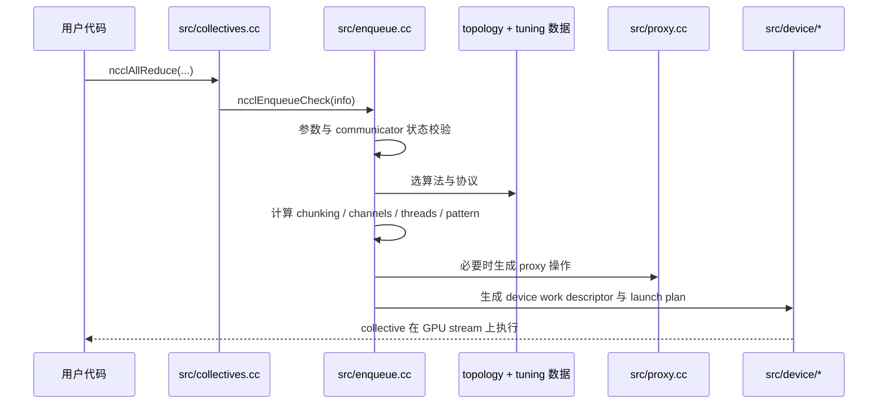
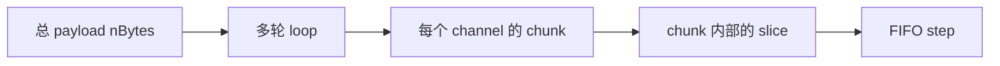

<!--
  SPDX-FileCopyrightText: Copyright (c) 2026 NVIDIA CORPORATION & AFFILIATES. All rights reserved.
  SPDX-License-Identifier: Apache-2.0

  See LICENSE.txt for more license information
-->

# Collective 执行链路：一次 `ncclAllReduce` 之后发生了什么

公开 API 看起来很薄，真正复杂的执行链路藏在下面。

这一页就顺着一次 collective，从 `src/collectives.cc` 里的 public wrapper
一路走到 device work descriptor，以及配套的 transport / proxy 机制。

## 1. 对外 wrapper 薄得惊人

像 `ncclAllReduce`、`ncclBroadcast`、`ncclReduceScatter` 这样的 public API
都在 `src/collectives.cc` 中。它们大体上都做同一件事：

1. 填一个 `ncclInfo` 结构体；
2. 把 collective 类型、buffer、count、datatype、reduction op、root 与
   stream 填进去；
3. 调用 `ncclEnqueueCheck(&info)`。

也就是说，真正的大脑不在 wrapper，而在 `enqueue.cc`。

## 2. 一张完整路径图

## 3. planner 比你想象得更像“总调度室”

`src/enqueue.cc` 在 launch 之前会做很多事：

- 检查 stream 和 communicator 状态，
- 进入 group 语义，
- 记录是否在 CUDA graph capture 中，
- 选择算法与协议，
- 决定 channel 数和线程数，
- 计算 chunk / slice / loop 结构，
- 为需要 CPU 推进的 transport 生成 proxy 操作，
- 产出最终 launch plan。

这就是为什么 `enqueue.cc` 是理解 NCCL 运行时思维方式的最佳单文件入口。

## 4. pattern：把“算法”翻译成“执行形状”

在 `src/enqueue.cc` 中，NCCL 会把 `(collective, algorithm)` 映射到具体执
行 pattern。典型映射包括：

| Collective | Algorithm | Pattern |
| --- | --- | --- |
| all-reduce | ring | `ncclPatternRingTwice` |
| all-reduce | tree | `ncclPatternTreeUpDown` |
| all-reduce | CollNet direct | `ncclPatternCollnetDirect` |
| all-reduce | CollNet chain | `ncclPatternCollnetChain` |
| all-reduce | NVLS | `ncclPatternNvls` |
| all-reduce | NVLS tree | `ncclPatternNvlsTree` |
| all-gather | ring | `ncclPatternRing` |
| all-gather | PAT | `ncclPatternPatDown` |
| reduce-scatter | ring | `ncclPatternRing` |
| reduce-scatter | PAT | `ncclPatternPatUp` |
| broadcast | tree | `ncclPatternTreeDown` |
| reduce | tree | `ncclPatternTreeUp` |

pattern 是“高层算法名称”和“真实分步执行方式”之间的桥。

## 5. step、slice、chunk、loop：最容易把人绕晕的一层

NCCL 在切分工作时有多层嵌套单位：

`src/enqueue.cc` 里的关键公式是：

- `stepSize = buffSizes[protocol] / NCCL_STEPS`
- `chunkSize = stepSize * chunkSteps`
- `loopSize = nChannels * nchunksPerLoop * chunkSize`
- `nLoops = ceil(nBytes / loopSize)`

### 大白话翻译

想象你在菜市场发货：

- `nBytes` 是今天全部待发货量；
- channel 是并行车道；
- chunk 是每车装的一大车；
- slice 是车里的若干箱；
- step 是装卸区的一个节拍槽位。

NCCL 做的，就是决定开几条车道、每车装多大、总共跑几趟。

### 超小算例

假设：

- `nBytes = 256 MiB`
- `nChannels = 4`
- `nchunksPerLoop = 8`
- `chunkSize = 1 MiB`

那么：

- `loopSize = 4 * 8 * 1 MiB = 32 MiB`
- `nLoops = ceil(256 / 32) = 8`

也就是说，NCCL 要跑 8 轮 loop 才能把全部 payload 搬完。

## 6. 算法与协议选择，本质是代价表最小化

`src/enqueue.cc` 中一个核心 helper 是 `topoGetAlgoInfo(...)`。它会读取已
经由 topology + tuning 子系统准备好的代价表，然后选出当前 collective 最
便宜的 `(algorithm, protocol)` 组合。

这个视角特别重要：

- `graph/tuning.cc` 负责构造“评分表”，
- `enqueue.cc` 负责消费这个评分表，
- 真正的 launch 决策是在 planner 这一层做出的。

## 7. CUDA Graph Capture 不是附带功能，而是被严肃处理的语义

helper `ncclPlannerSetCapturingGraph(...)` 会跟踪流是否正处在 CUDA graph
capture 中，并确保一组 NCCL group 中涉及的 streams 要么全都没 capture，
要么必须属于同一个 capture graph。

所以当你在 group 中混用了 capture 语义不一致的 streams 时，NCCL 给你报
invalid-usage 并不是“多事”，而是在保护一致性。

## 8. Reduction operator：average 是个很好的例子

`src/enqueue.cc` 里的 `hostToDevRedOp(...)` 暗示了一个很妙的设计点：
`avg` 在不同数据类型上，不一定用同一种内部表示。

数学上它当然很简单：

- `avg = sum / n`

但在实现上：

- 整数更适合“先 sum，后除”；
- 浮点更适合“先乘 `1/n`，再 sum”。

比如 4 个数的平均值：

- `(2 + 6 + 8 + 4) / 4 = 5`

也可以理解成：

- `2/4 + 6/4 + 8/4 + 4/4 = 0.5 + 1.5 + 2 + 1 = 5`

数学没变，只是机器喜欢的表示不同。

## 9. 设备侧执行是最后一步，不是第一步

host 侧所有规划做完之后，真正的执行才会落到 `src/device/`。最值得先看的
文件是：

- `src/device/primitives.h`
- `src/device/prims_ll.h`
- `src/device/prims_ll128.h`
- `src/device/prims_simple.h`
- `src/device/all_reduce.h`
- `src/device/all_gather.h`
- `src/device/reduce_scatter.h`

非常推荐的读法是：

1. 先在 `enqueue.cc` 里看 host 侧选了什么 pattern；
2. 再去对应 collective 文件里看设备实现；
3. 最后去对应 protocol primitive 里看细节。

这样脑中的层次不会乱。
