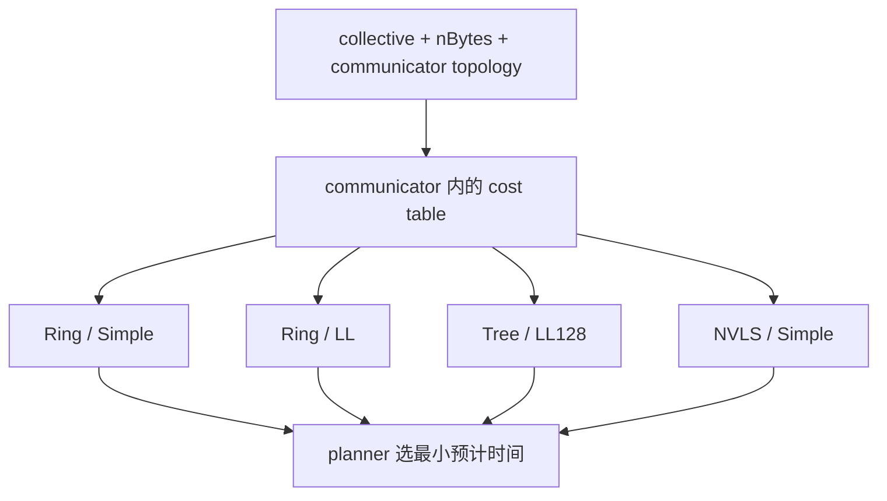
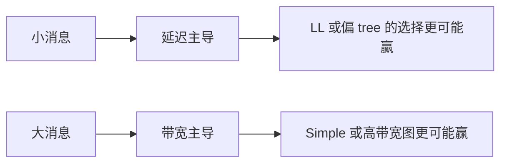

<!--
  SPDX-FileCopyrightText: Copyright (c) 2026 NVIDIA CORPORATION & AFFILIATES. All rights reserved.
  SPDX-License-Identifier: Apache-2.0

  See LICENSE.txt for more license information
-->

# 数学与性能：把 NCCL 公式翻译成人话

这是整套文档里最重要的一页之一，因为它专门负责“降维打击”。

NCCL 的性能模型看起来吓人，是因为它把拓扑、channel 数、协议上限和延迟模
型揉在了一起。但如果你把皮剥开，会发现它的骨架其实仍然是最朴素的一件事：

> 预计耗时 = 启动开销 + 搬运数据的时间

## 1. 先看总决策图

NCCL 会把估计结果存进 communicator 的 `bandwidths[...]` 与 `latencies[...]`
数组里，后面 `src/enqueue.cc` 收到真实 collective 时，就从这些备选项里选最
便宜的。

## 2. 一条必须记住的总公式

一个非常实用的心理模型是：

$$
\text{estimated time} \approx \text{latency} + \frac{\text{bytes}}{\text{effective bandwidth}}
$$

### 每个量到底意味着什么

| 符号 | 现实世界含义 |
| --- | --- |
| latency | 就算消息很小，你也逃不掉的固定启动与逐步推进延迟 |
| bytes | 真正需要搬运的 payload 大小 |
| effective bandwidth | 考虑完拓扑、channels、协议与算法结构后，真正有用的带宽 |

如果你这一页只带走一个公式，就带走它。

## 3. 公式一：bus 带宽

`src/graph/tuning.cc` 里一个最核心的公式是：

$$
\text{busBw} = \text{nChannels} \times bw
$$

### 它在系统里是什么意思

- `bw`：单个 channel 预计能跑到的带宽；
- `nChannels`：NCCL 打开的并行车道数；
- `busBw`：NCCL 认为整台系统在这个候选方案下，能往 fabric 上打出的总原始带宽。

### 菜市场级小算例

假设每条车道能跑 `25 GB/s`，总共开了 `4` 条车道：

$$
\text{busBw} = 4 \times 25 = 100\,GB/s
$$

意思就是：从 NCCL 的视角看，这套候选方案大概能把 `100 GB/s` 的流量推到
总线/链路上。

## 4. 公式二：ring all-reduce 的有效带宽

对于 ring 路径，模型会再乘上一个“有用工作 / 总步骤”的比例。

在 all-reduce 中，NCCL 会用：

$$
\text{nsteps} = 2 \times (nRanks - 1)
$$

然后用大致如下的比例：

$$
\frac{nRanks}{nsteps}
$$

### 这是什么意思

ring all-reduce 里，数据不是一瞬间从每张卡同时飞到每张卡手里，而是沿着环
一站一站转。于是总线上的很多流量并不是“最终有效结果”，而是为了把结果
绕完整个环必须付出的中间搬运。

所以 NCCL 会把原始 `busBw` 再折算成“真正有效的算法带宽”。

### 小学生都能秒懂的数字例子

假设总共有 `8` 个 ranks：

$$
\text{nsteps} = 2 \times (8-1) = 14
$$

如果原始 `busBw = 100 GB/s`，那么有效 ring 带宽大致是：

$$
100 \times \frac{8}{14} \approx 57.1\,GB/s
$$

如果 payload 是 `1 GB`，那光按带宽粗算的搬运时间大约是：

$$
1 / 57.1 \approx 0.0175\,s = 17.5\,ms
$$

再加上启动延迟，就是总估计时间的大头。

## 5. 公式三：tree all-reduce 的延迟

在 `src/graph/tuning.cc` 中，tree all-reduce 的延迟表达式长这样：

$$
2 \times \left((nRanks/nNodes - 1) \times intraLat + \log_2(nNodes) \times interLat\right)
$$

### 符号拆解成现实意义

- `intraLat`：节点内延迟，也就是同机内 GPU 之间或本地汇聚的代价；
- `interLat`：跨节点延迟，也就是网间/节点间通信代价；
- `nRanks/nNodes - 1`：本节点里还需要吸收多少个本地伙伴；
- `log2(nNodes)`：跨节点树高，大概就是树要爬几层；
- 前面的 `2`：all-reduce 不是单向动作，要“上去一次，再下来一次”。

### 超直观数字例子

假设：

- 总共 `8` 个 ranks，分布在 `2` 个节点；
- 每个节点 `4` 个 ranks；
- `intraLat = 0.8 us`；
- `interLat = 3.0 us`。

则：

$$
2 \times ((4-1) \times 0.8 + \log_2(2) \times 3.0)
= 2 \times (2.4 + 3.0)
= 10.8\,us
$$

这就是为什么 tree 类方案常常在小消息上很强：因为此时延迟往往比带宽更主导。

## 6. 协议直觉：Simple、LL、LL128 到底像什么

你完全可以把 NCCL 的 protocol 想成不同型号的运输工具：

| Protocol | 生活类比 | 典型直觉 |
| --- | --- | --- |
| Simple | 大货车 | 大 payload 峰值带宽高 |
| LL | 快递电动车 | 小消息启动快，延迟敏感场景常赢 |
| LL128 | 压缩装箱更好的面包车 | 介于两者之间，某些区间非常香 |

这只是直觉，不是死规则。真正决策依旧来自完整 cost table。

## 7. Average reduction：数学上根本没那么神秘

`hostToDevRedOp(...)` 这个 helper 暗示了一个非常漂亮的实现思想：`avg` 会根
据数据类型换不同内部表示。

数学上当然只有一句话：

$$
\mathrm{avg}(x_1, ..., x_n) = \frac{x_1 + ... + x_n}{n}
$$

但浮点数上，NCCL 也可以把它看成：

$$
\frac{x_1}{n} + \frac{x_2}{n} + ... + \frac{x_n}{n}
$$

### 一个买菜大妈也能听懂的例子

四个人合买西瓜，分别出了：2 元、6 元、8 元、4 元。

平均每人出多少钱？

- 先加后除：`(2 + 6 + 8 + 4) / 4 = 5`
- 先各自除后加：`2/4 + 6/4 + 8/4 + 4/4 = 0.5 + 1.5 + 2 + 1 = 5`

数学完全一样，但在机器实现里，两种表示对不同数据类型的友好程度不同。

## 8. tuner 插件改变的是“偏好”，不是数学真理

`plugins/tuner/README.md` 解释得很清楚：tuner 插件可以直接改 cost table。

所以更准确的说法是：

- NCCL 默认模型是一套很强的启发式工程经验；
- 但它并不是宇宙唯一真理；
- 大规模站点可以根据自己的硬件和 workload，把偏好改得更贴地气。

可以把它总结成一句特别重要的话：

> NCCL 的模型是“带公式的策略引擎”，不是“放之四海皆准的数学定理”。

## 9. 为什么代码里会出现很多 `.92`、`.85`、`1/3.8` 这种系数

在 `src/graph/tuning.cc` 里你会看到很多看似突兀的修正因子。

别把它们看成“数学之美”，更应该把它们看成“工程记忆”。它们浓缩了：

- 协议封装效率，
- 链路上限，
- 架构特征，
- 以及大量真实平台上踩坑后的经验修正。

## 10. 一个农产品运输类比，把整页彻底讲明白

假设 8 个农户要互相交换土豆：

- 路开得越多，就是 channels 越多；
- 路越宽，就是单 channel `bw` 越高；
- ring 像沿着村道挨家挨户绕圈送；
- tree 像先往村中心收，再往外分发；
- 小包裹更怕收费站排队，也就是 latency；
- 大货车更怕道路太窄，也就是 bandwidth。

这其实就是 NCCL 性能模型的全部直觉核心。

## 11. 这一页最值得反复对照的源码文件

- `src/graph/tuning.cc`
- `src/enqueue.cc`
- `src/include/comm.h`
- `plugins/tuner/README.md`
