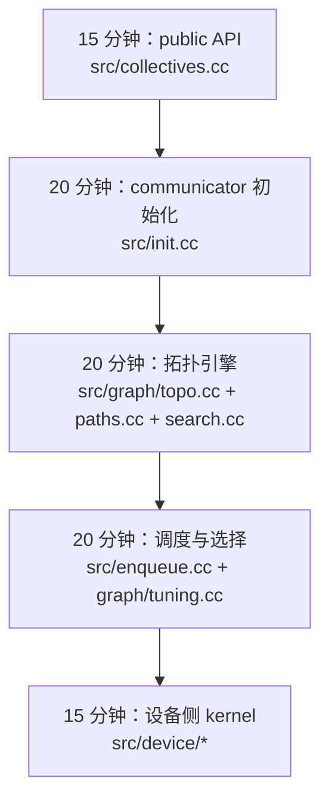

<!--
  SPDX-FileCopyrightText: Copyright (c) 2026 NVIDIA CORPORATION & AFFILIATES. All rights reserved.
  SPDX-License-Identifier: Apache-2.0

  See LICENSE.txt for more license information
-->

# 快速上手：像系统工程师一样读 NCCL

在正式深挖前，先抓住三个最值钱的抓手：

1. 先把库编起来，
2. 先把示例跑起来，
3. 先知道哪个文件对应哪个运行时阶段。

这三步做完，NCCL 的陌生感会立刻掉一大截。

## 为什么要这样开始

大多数人第一次认真看 NCCL，往往不是因为“有空学习”，而是因为线上或
实验室里已经出问题了：

- 八张昂贵 GPU 跑不满，
- 小消息延迟离谱，
- collective 选了一个看起来很怪的路径，
- 多机训练在某些节点上明显掉速。

这时候最需要的不是再看一遍 API 说明，而是把“公开接口”与“真实源码决
策点”迅速接上线。

## 1. 先构建库

仓库根目录执行：

```bash
make -j src.build
```

如果 CUDA 不在 `/usr/local/cuda` 下：

```bash
make -j src.build CUDA_HOME=<path-to-cuda>
```

如果你还要把仓库内自带示例也一起编出来：

```bash
make -j examples
```

带 MPI 支持的示例：

```bash
make -j examples MPI=1
```

如果 NCCL 已经编好，只想单独编示例：

```bash
cd docs/examples
make NCCL_HOME=<path-to-nccl> [MPI=1]
```

以上命令都直接来自仓库根目录 `README.md` 与 `docs/examples/README.md`。

## 2. 先读可运行示例，不要一开始就硬啃抽象原理

最值得先看的入口有三个：

- `docs/examples/01_communicators/`：communicator 是怎么创建与销毁的
- `docs/examples/03_collectives/01_allreduce/`：最小可运行 collective 例
  子
- `docs/examples/06_device_api/`：更新的设备侧通信能力演示

如果你的目标是性能测试而不是教学示例，请直接去根目录 `README.md` 提
到的外部仓库 `nccl-tests`。

## 3. 开日志，相当于给 NCCL 装 CT

很多时候，最快的理解方式不是猜，而是让 NCCL 自己把决策过程吐给你：

```bash
NCCL_DEBUG=INFO NCCL_DEBUG_SUBSYS=INIT,GRAPH,TUNING,NET ./your_program
```

简单记忆：

- `INIT` 看 communicator 是怎么起来的
- `GRAPH` 看机器拓扑和图搜索结论
- `TUNING` 看性能模型认为谁更便宜
- `NET` 看网络路径与插件

## 4. 一个 90 分钟的源码游览路线



### 第一步：public API

先开 `src/collectives.cc`。你会发现一个很重要的事实：NCCL 对外暴露的
collective API 几乎都很薄。它们主要是拼一个 `ncclInfo`，然后调用
`ncclEnqueueCheck(...)`。

### 第二步：communicator 初始化

再看 `src/init.cc`。这里是 `ncclCommInitRank`、`ncclCommInitAll`、
`ncclCommSplit` 等入口汇流的地方。真正的重心是 `ncclCommInitRankFunc(...)`
和 `initTransportsRank(...)`。

### 第三步：拓扑引擎

打开 `src/graph/topo.cc`、`src/graph/paths.cc`、`src/graph/search.cc`。
这一组文件回答的问题是：

> 我现在到底运行在什么机器上？以及在这台机器上，最值得构建什么通信图？

### 第四步：调度与选择

打开 `src/enqueue.cc` 和 `src/graph/tuning.cc`。这里 NCCL 把拓扑信息转成
代价表，再为每个 collective 决定算法、协议、channels、chunk size 与
threads。

### 第五步：设备侧执行

打开 `src/device/primitives.h` 和一个具体 collective 文件，比如
`src/device/all_reduce.h`。这时你看到的，才是最终真正在 GPU 上跑的逻辑。

## 5. 一组非常值得先背熟的词

| 术语 | 大白话解释 |
| --- | --- |
| communicator | 参与通信的一组 rank 共享的运行时状态 |
| channel | 一条并行数据通道；channel 越多，通常并行搬运越强 |
| algorithm | 高层通信形状，比如 ring、tree、PAT、CollNet、NVLS |
| protocol | 底层搬运风格，比如 Simple、LL、LL128 |
| transport | 两个 peer 之间具体怎么接通，比如 P2P、SHM、NET |
| proxy | 需要 CPU 协助推进的那部分宿主侧逻辑 |
| topology graph | NCCL 对 GPU、CPU、NIC、交换机和链路做出的内部抽象图 |

## 6. 三条非常实用的读码路线

### “communicator 到底怎么活起来？”

读 `src/init.cc` -> `src/bootstrap.cc` -> `src/graph/connect.cc`

### “为什么这次选了 ring 而不是 tree？”

读 `src/graph/tuning.cc` -> `src/enqueue.cc` -> `plugins/tuner/README.md`

### “为什么多机网络这么慢？”

读 `src/transport.cc` -> `src/transport/net.cc` -> `src/plugin/net.cc` ->
`plugins/net/README.md`

## 7. 一个最值得带着走的脑图

把 NCCL 想成一家物流公司：

- 应用下单，
- communicator 像运输合同，
- 拓扑引擎像绘制路网，
- tuning 模型像估算各条线路的送达时间，
- planner 决定开多少车、每车装多少货、走几条车道，
- GPU kernels 则是真正搬箱子的工人。

脑图一旦建立，源码树就不再像迷宫。
