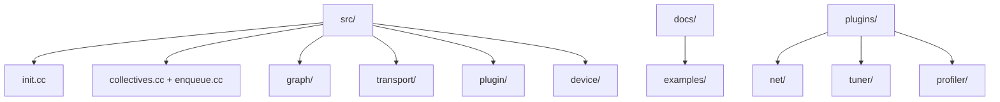

<!--
  SPDX-FileCopyrightText: Copyright (c) 2026 NVIDIA CORPORATION & AFFILIATES. All rights reserved.
  SPDX-License-Identifier: Apache-2.0

  See LICENSE.txt for more license information
-->

# 源码地图：不同问题，先看哪些文件

这一页不是讲故事，而是给你当“作战地图”。读仓库时请一直开着它。

## 1. 目录层级地图



## 2. 如果你在问 X，就先开 Y

| 问题 | 第一优先文件 | 接着看 | 为什么 |
| --- | --- | --- | --- |
| `ncclCommInitRank` 怎么工作？ | `src/init.cc` | `src/bootstrap.cc` | init 会一路汇入 bootstrap 与 transport setup |
| collective 的 public API 在哪？ | `src/collectives.cc` | `src/enqueue.cc` | wrapper 很薄，真正的大脑在 planner |
| 为什么选了 ring/tree/NVLS？ | `src/graph/tuning.cc` | `src/enqueue.cc` | tuning 造评分，enqueue 做消费 |
| 机器拓扑怎么识别？ | `src/graph/topo.cc` | `src/graph/paths.cc` | 先建图，再算路径 |
| 通信图怎么搜索？ | `src/graph/search.cc` | `src/graph/connect.cc` | search 选候选，connect 落 channels |
| ring/tree 邻接关系存哪？ | `src/graph/connect.cc` | `src/include/comm.h` | 连接综合后会写进 communicator 状态 |
| transport 怎么选？ | `src/transport.cc` | `src/transport/p2p.cc`, `src/transport/net.cc` | 前者是注册表，后者是具体实现 |
| network plugin 怎么加载？ | `src/plugin/plugin_open.cc` | `src/plugin/net.cc` | 前者是通用 loader，后者是 net 版本探测 |
| tuner plugin 怎么加载？ | `src/plugin/tuner.cc` | `plugins/tuner/README.md` | 最能看清 core / plugin 分工 |
| proxy progress 在哪？ | `src/proxy.cc` | `src/transport/*` | proxy 与 transport 推进强耦合 |
| device primitive 在哪？ | `src/device/primitives.h` | `src/device/prims_*.h` | 协议细节都在这里 |
| device 头文件分层怎么读？ | `src/include/nccl_device/README.md` | `src/include/nccl_device/*.h` | 专门解释了人类友好的头文件层级 |

## 3. 按时间预算制定读码计划

### 30 分钟版

- `src/collectives.cc`
- `src/enqueue.cc` 中 `ncclEnqueueCheck(...)` 附近
- `src/graph/tuning.cc`

目标：先理解 NCCL 是一个 cost-based planner，而不是一个固定 kernel。

### 2 小时版

- `src/init.cc`
- `src/bootstrap.cc`
- `src/graph/topo.cc`
- `src/graph/search.cc`
- `src/graph/connect.cc`
- `src/enqueue.cc`

目标：看清完整 host 侧控制路径。

### 1 天版

继续加上：

- `src/transport.cc` 与 `src/transport/*`
- `src/proxy.cc`
- `src/device/primitives.h`
- 一个 collective 设备侧文件，例如 `src/device/all_reduce.h`
- `plugins/` 下的 plugin README

目标：真正理解为什么同一套 API 在不同机器上会呈现不同性能行为。

## 4. 本地探索时最好用的搜索命令

在仓库根目录执行：

```bash
rg "ncclCommInitRank" src/init.cc
rg "ncclEnqueueCheck|topoGetAlgoInfo" src/enqueue.cc
rg "ncclTopoCompute|ncclTopoTuneModel" src/graph
rg "selectTransport|ncclTransports" src/transport.cc src/transport
rg "ncclTunerPluginLoad|ncclOpen.*PluginLib" src/plugin
```

这些搜索词和本套文档讲述的主轴高度对齐，特别适合第一次进场时快速定位。

## 5. 仓库里本来就值得读的现成文档

| 文件 | 价值 |
| --- | --- |
| `docs/examples/README.md` | 可运行示例与编译方式 |
| `plugins/net/README.md` | 最清楚的 NET plugin 边界说明 |
| `plugins/tuner/README.md` | cost table 如何被 override |
| `plugins/profiler/README.md` | NCCL 如何暴露运行时事件给 profiler |
| `src/include/nccl_device/README.md` | 设备侧头文件如何为“可读性”做分层 |

## 6. 最后送你一个读码诀窍

当某个文件显得特别抽象时，强迫自己问下面三个问题：

1. 这个文件到底在做什么运行时决策？
2. 它把决策存进了哪个数据结构？
3. 后面哪个文件会消费这个结构？

一旦养成这个习惯，NCCL 的源码树就不再是一堆孤岛，而会变成一条清晰的因果
链。
