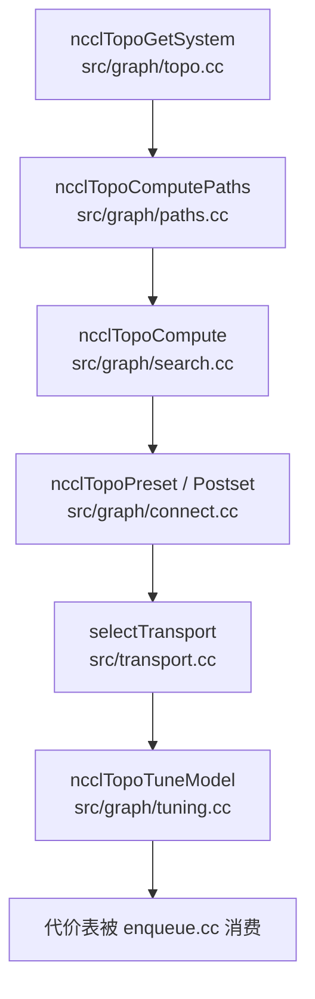

<!--
  SPDX-FileCopyrightText: Copyright (c) 2026 NVIDIA CORPORATION & AFFILIATES. All rights reserved.
  SPDX-License-Identifier: Apache-2.0

  See LICENSE.txt for more license information
-->

# 拓扑与调优：NCCL 如何把硬件现实变成决策

在 NCCL 里，硬件几乎就是命运。

某个 ring 在 NVLink 小岛上可能近乎完美，但跨 PCIe 之后就会变得平庸；某个
协议在 1 KiB 小消息上极强，到了 1 GiB 大消息上却可能极差。理解 NCCL 的
关键，就在于理解它怎么认识硬件、怎么把硬件转成决策。

## 1. 从金属到模型的一整条流水线



## 2. `ncclTopoGetSystem`：先把机器画成图

`src/graph/topo.cc` 的工作，是把 GPU、CPU、NIC、PCIe 交换机、NVSwitch 以
及它们之间的链路，构造成 NCCL 自己内部的一张图。

重点不是“收集几个字段”，而是“搭出后续搜索和调优都要依赖的硬件图模型”。

这个文件里还有不少硬件特例处理，比如把某些会误导搜索的 PCIe 交换机层级
扁平化。这提醒我们：拓扑发现永远不是纯理论工作，而是必须能扛住真实硬件
怪脾气的工程系统。

## 3. `ncclTopoComputePaths`：把“能到”和“怎么到”分类清楚

原始图建立之后，`src/graph/paths.cc` 会计算 GPU 到 GPU、GPU 到 NIC 等关键
端点之间的可达性与路径类别。

可以粗暴记住这些 path type：

| 路径类型 | 直觉含义 |
| --- | --- |
| `LOC` | 基本不需要穿越 fabric |
| `NVL` | 直连 NVLink |
| `NVB` | 经过 switch/bridge 的 NVLink |
| `C2C` | 芯片间直接连通 |
| `PIX` | 同一个 PCIe switch 内 |
| `PXB` | 跨多个 PCIe switch |
| `P2C` | 涉及 CPU/root complex |
| `PXN` | 借邻居 GPU/NIC 做的代理网络路径 |
| `PHB` | 穿 host bridge |
| `SYS` | 更宽范围的系统/NUMA 链路 |
| `NET` | 直接上网络 |

你不必死记每个缩写，真正重要的是：NCCL 会把一团混乱的物理世界压缩成“可
比较、可排序”的路径类别。

## 4. `ncclTopoCompute`：搜索通信图

真正的图搜索重头戏在 `src/graph/search.cc`。它会搜索 ring、tree、CollNet、
NVLS 等候选图，同时考虑：

- 节点内/节点间带宽，
- 路径类型约束，
- channel 数量，
- 是否允许 cross-NIC，
- 是否复用相同 channels，
- 搜索超时预算。

这不是课本里的最短路算法，而是专门服务 collective 通信结构的“图搜索引
擎”。

### 这一层真正回答的问题是

NCCL 不是只在问：

> rank A 能不能到 rank B？

它更关心的是：

> 对整个 communicator 来说，应该搭一副什么骨架，才能让 collective 最快？

## 5. Search pattern 和 algorithm 不是一回事

一个很重要但容易混淆的区分：

- **algorithm** 是高层通信策略；
- **pattern** 是实现时真正执行的形状。

比如 ring、tree 是 algorithm，而 `enqueue.cc` 之后会把它们进一步映射成
`ncclPatternRingTwice`、`ncclPatternTreeUpDown` 这类 pattern。图搜索层则是
为这些 pattern 准备拓扑骨架。

## 6. `ncclTopoPreset` / `ncclTopoPostset`：让图真正落地

一旦搜索出了图，`src/graph/connect.cc` 会把它们变成真实 communicator 中可用
的 channel 关系。

- `ncclTopoPreset(...)`：初始化本 rank 在 ring/tree/CollNet/NVLS 里的角色
- `ncclTopoPostset(...)`：把所有 rank 的图信息整合成最终 channel 布局

这两个阶段的区别非常值得记牢：

- **search** 决定“图长什么样”；
- **connect** 决定“每个 rank 在图里究竟站在哪”。

## 7. transport 选择天然依赖拓扑

channel 确定之后，NCCL 还要为每一条边选具体 transport。

```mermaid
flowchart LR
    Pair[peer pair + channel + connIndex] --> Select[selectTransport(...)]
    Select --> P2P[p2pTransport]
    Select --> SHM[shmTransport]
    Select --> NET[netTransport]
    Select --> CN[collNetTransport]
```

`src/transport.cc` 里的顺序很关键，因为 `selectTransport(...)` 是按顺序询问
候选项：“你能不能接上这条边？”谁先能连，谁就被选中。

这让 NCCL 的策略边界非常清晰：

- topology 决定“我想要什么结构”；
- transport 决定“这条结构边具体怎么走”。

## 8. `ncclTopoTuneModel`：把拓扑转成“时间估计”

`src/graph/tuning.cc` 会把前面搜索出来的 graphs 转成一张张带宽和延迟估计
表，覆盖以下组合：

- collective 类型，
- algorithm，
- protocol。

这些结果会存进 communicator，后面 `enqueue.cc` 真正收到 collective 时就直
接拿来做选择。

换句话说，tuning model 本质上是在回答：

> 在这台机器、这个 communicator、这类消息规模下，哪种选择最可能快？

## 9. tuner 插件可以重写“偏好表”

`src/plugin/tuner.cc` 会根据 `NCCL_TUNER_PLUGIN` 加载外部 tuner 插件。插件可
以直接修改代价表，然后再交给 planner 去选。

这点对大规模集群特别重要：站点完全可以根据自己的硬件和工作负载，对 NCCL
默认偏好进行再定制，而不需要重编 NCCL 核心。

配套阅读首推 `plugins/tuner/README.md`。

## 10. 一个最直觉的生活类比

把 NCCL 想成一个同城+跨城物流调度系统：

- topology discovery 负责画城市路网，
- path computation 负责标出哪些路宽、哪些路窄，
- graph search 负责给所有小区设计一套配送骨架，
- transport selection 负责给每条路配上自行车、面包车还是货车，
- tuning 负责估算送达时长，
- enqueue 则在真正来单时按当前货量派出最划算的方案。

这就是 NCCL 的 topology + tuning 栈。

## 11. 最值得反复开的源码锚点

- `src/graph/topo.cc`
- `src/graph/paths.cc`
- `src/graph/search.cc`
- `src/graph/connect.cc`
- `src/graph/tuning.cc`
- `src/transport.cc`
- `src/plugin/tuner.cc`
- `plugins/tuner/README.md`
