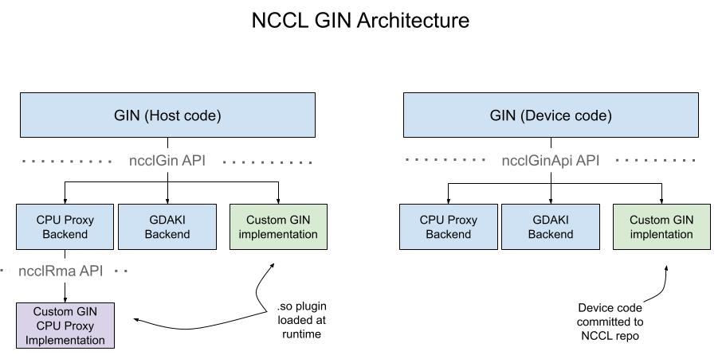
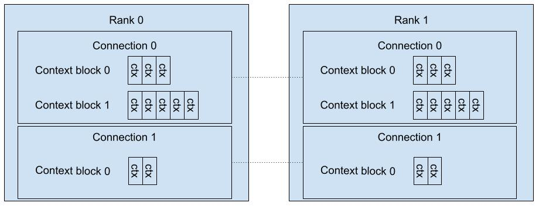

# GIN Developer Guide

This document is for engineers developing a custom GIN implementation.

## Architecture

NCCL GIN has 2 paths for custom implementation:

* Custom implementation via GIN CPU Proxy. Here, NCCL implements the device-side GIN API and
translates GIN requests into host-initiated network operations. Custom implementations only need to
implement the host-side API.
* Full custom implementation. This enables GPUDirect-Async implementations on custom networks.
Here, custom implementations need to implement both a device-side and a host-side API.

The complete architecture looks like this:

The purple box is the custom implementation via GIN CPU Proxy. This implementation shares the
same host plugin API as NCCL RMA. Refer to `plugins/rma/README.md` for details.

The remainder of this document focuses on the full NCCL GIN custom implementation. There's 2 components,
shown as the green boxes in the diagram:

* ncclGin: host-side API. Provided via a plugin loaded at runtime.
* ncclGinApi: device-side API. This code is generally checked into the NCCL repo.

This document uses `ncclImpl` to refer to NCCL's internal (non-customized)
implementations of these APIs. References to `ncclImpl`
are just examples, custom implementations may make other design decisions.

## GIN Concepts

### Core Concepts

**GIN support**

A critical piece of information for NCCL is whether GIN is supported. GIN support
determines whether the Device API can use GIN, and whether NCCL can use internal
kernels that require GIN.

NCCL relies on the plugin to determine if GIN is supported. If the plugin succeeds init,
GIN is considered supported. For this reason, users should add sanity checks to init (not
connect or any other later function) wherever possible. For example, ncclImpl checks for
GDR support in init, and fails if GDR is not available.

**GIN connections and contexts**

A connection is a (src, dst) network device pair. A GIN context is a sub-resource of a
GIN connection; the plugin manages one or more *connections*, each of which has one or
more *contexts*. GIN contexts are allocated in blocks of varying sizes:

The primary goal of GIN contexts is to increase network performance by increasing
parallelism, with separate, parallel communication channels, which are independent
from each other ordering-wise. GIN contexts are typically used by different CUDA CTAs
processing data independently. In `ncclImpl`, each GIN context corresponds to a different
queue pair.

Each context manages a fixed number of GIN resources (e.g. counters, signals, barriers).
GIN ordering guarantees apply within a single context. For example, the completion
of a signal guarantees the completion of all previous puts *on the same context*.
For the remainder of this document, you may assume order requirements are per-context.

The number of connections is expected to be very low. As of this writing, the max is
4 and multiple connections are only created if a rank has affinity to multiple network
devices (e.g. dual port NICs). The typical number of contexts is \~4-256, although
nothing prevents applications from creating more or less.

Note: a GIN context is a user-facing concept, but a GIN connection is internal to NCCL
and the plugins. NCCL decides how user contexts map to plugin connections and contexts.

### Operations

**Put/PutValue**  
Put moves data from a local source buffer to a (likely remote) target buffer. PutValue places
a value in a target buffer. Puts are not required to be completed in the order they are requested.

A single call to `Put` or `PutValue` may include a signal or counter operation. See below for
more details.

**Get**  
Get moves data from a (likely remote) source buffer to a local target buffer. Gets are
not required to be completed in the order they are requested.

**Signal**  
Signal increments a target memory address by a fixed value. There's 2 types of visibility guarantees:
strong and weak. The visibility of a *strong* signal guarantees the completion/visibility of all previous
puts and signals, including the bundled put in the case of put+signal. The visibility of a *weak*
signal guarantees the completion/visibility of the bundled put (in the case of put+signal), but makes
no guarantees on previous puts or previous signals.

**Flush**  
Flush ensures all previous operations are locally complete. In the case of gets, flush indicates
the data is visible and ready to use. In the case of puts, flush indicates source buffers are
ready for reuse.

**Counter**  
Counter increments a local memory address by a fixed value. The completion/visibility of a counter
guarantees the local completion of a bundled put. It does not guarantee completion at the target,
nor local completion of any previous puts.

## Host-side Plugin (`ncclGin`)

### Query properties

Some features (e.g. strong signals, VA signals) are not supported by all backends. Feature support is
queried via `getGinProperties`.

If an application requires a feature that is not supported by a specific backend, NCCL will not use
that backend. NCCL will fall back to a backend that supports the required features, if such a backend is available.
Otherwise, NCCL will fail.

### Connection Setup

One `collComm` is created per GIN connection. A `collComm` manages connections to all
peers. A `collComm` is initialized in several steps:

1) NCCL calls `listen` on all ranks in the communicator. `listen` returns an opaque `listenComm` and `handle`.
2) NCCL exchanges handles among all peers.
3) NCCL calls `connect` on all ranks and includes a list of all peers' handles. `connect` returns an opaque `collComm`.

`ncclImpl` initializes a TCP socket in `listen` and stores it in `listenComm`. The address of the socket is included in `handle` so
that all peers can connect to the socket.

### Context Setup

GIN contexts are allocated in blocks via `createContext`. Each block of GIN contexts has a
corresponding opaque `ginCtx` and `ncclNetDeviceHandle_t` defined by the plugin. `ginCtx` is
the host-side descriptor and `ncclNetDeviceHandle_t.handle` is the device-side descriptor.

`createContext` also passes in a `backendVersion`, which allows plugins to check and adapt for
device/host version compatibility or to fail gracefully if there is a version mismatch. See
[Version compatibility](#version-compatibility) below for more details.

### Memory registration

The GIN functions for memory registration are `regMrSym` and `regMrSymDmaBuf`. These functions
are called once per memory region, per connection.

GIN memory registration is symmetric. If a call to `regMrSym` is made on one rank, the plugin may
assume `regMrSym` is called on all ranks. The returned handles should have enough information
for the custom implementation to execute GIN operations on the local buffer and the
remote buffers of all peers.

Registered memory is referenced via the opaque types `mHandle` and `ginHandle`.
`mHandle` is used for host-side control operations like `deregMr`. `ginHandle`
is used for data operations.

Memory registration also accepts an optional `mrFlags` argument. If memory is registered
with `NCCL_NET_MR_FLAG_FORCE_SO`, the memory region may be used for signal operations.

For GDAKI, `ncclImpl` stores the `ib_mr` in `mHandle` (for deregistration) and rkeys/lkeys
in `ginHandle` (which is allocated on the device by `ncclImpl`). `ncclImpl` does an allgather
in each call to exchange keys among peers. If `NCCL_NET_MR_FLAG_FORCE_SO` is set, `ncclImpl`
forces strict PCIe ordering when registering the mr with the NIC.

### Data operations

GIN data operations are submitted via the device-side backend. Some implementations may
require help from a CPU thread to progress the operations. The plugin exposes a `ginProgress`
function for such cases. This function is operation-independent and is called periodically
regardless of whether a data operation is pending.

`ginProgress` is optional; plugins indicate the need for `ginProgress`
during `connect` via a field in `ncclNetDeviceHandle`.

## Device-side backend (`ncclGinApi`)

### Key Concepts

**ncclGinCtx**

A `ncclGinCtx` contains metadata associated with a GIN context. The most important fields are:

*  `handle`: a pointer to the context block returned by `createContext` via `ncclNetDeviceHandle_t->handle`.
* `contextId`: index within the block for this specific context

**ncclGinWindow**

This is the pointer returned as `ginHandle` in `regMrSym`.

**Coop**  

In many places, the backend API supplies a `coop` argument. `coop` specifies the threads
calling/participating in the operation. `coop` can be used for both correctness and performance:
developers must ensure critical sections are executed by just one thread, but may use
multiple threads to parallelize work.

**Signal**

A signal is a 64 bit memory location. There’s 2 kinds: indexed signal and VA signal.
Indexed signals are created by the host when `createContext` is called. The plugin is
responsible for allocating device memory accordingly. A VA signal is an arbitrary window/offset
memory location allocated by the user and registered with NCCL.

All writes to a signal are done via the backend API (e.g. either `ResetSignal` or `Put` (with signal)).
For indexed signals, all reads are done via `GetSignalPtr`, which should return a device-side
address that can be read using CUDA atomic operations (e.g. `cuda::atomic_ref`).

Some backends choose to "reset" indexed signals by caching an offset (the value at the time of reset).
Accordingly, `GetSignalPtr` returns an offset. Backends can return an offset of 0 if `ResetSignal`
actually sets the memory location of the indexed signal to 0.

**Abort flag**  

Many blocking functions supply an `abortFlag` argument. When true, the function should return
immediately. The function (and corresponding state) can have undefined behavior if it returns
early due to an abort flag. `abortFlag` may be null, in which case the function should return
only when the requested operation is complete.

**Counter**  

A counter is a 64-bit *local* memory location allocated by the custom implementation. All
writes are done via the backend API (e.g. either `ResetCounter` or `Put` (with counter)).
All reads are done via `GetCounterPtr`, which should return a device-side address that can
be read using CUDA atomic operations (e.g. `cuda::atomic_ref`). Similar to signals,
`GetCounterPtr` returns an offset in case backends wish to "reset" counters by caching an offset.

**DescriptorSmem**  

`DescriptorSmem` is a 64-byte, user-allocated, shared-memory scratch pad. As an optional
performance improvement, implementations may use this scratch pad instead of reallocating
internal structs on each API call. Users can reuse one `DescriptorSmem` across many
non-overlapping GIN calls, but they do not have to.

**Optimization flags**  

GIN exposes several optimization flags in the form of `ncclGinOptFlags`.
The flags include:

* `ncclGinOptFlagsAggregateRequests`. Users specify this flag if more requests are
expected in the near future. Implementations can reduce overhead by delaying some logic
until after the batch is complete. For example, `ncclImpl` skips ringing the doorbell when
this flag is specified (and rings it once for all requests when the flag is no longer specified).

## Types summary

Many GIN objects need host and device descriptors. Here is a summary:

| Concept   | Host descriptor     | Host-side pointer to device descriptor       |   Device descriptor |
|---------- |-----------|---------------------------------------|---------------------------------------|
| Context  | ginCtx     | ncclNetDeviceHandle_t->handle    |  ncclGinContext->handle
| Memory region | mHandle  | ginHandle | ncclGinWindow

## Version compatibility

The version of the device code may diverge from the version of the plugin. This is problematic for
any structs that are shared by the host and device (e.g., contexts, windows). If the size or
format of these structs change across versions, the plugin may allocate and initialize the struct in a
format the device code does not understand.

Backend versions track such incompatibilities. Backend version is a per-backend concept defined in the core NCCL code.
Backends should increment the version each time the format of a struct changes.

NCCL maps the NCCL version (e.g. 2.30.4) to the corresponding backend version and passes the backend
version to the plugin. Plugins can use the backend version in a few ways:

1. Fail on version incompatibility. If `backendVersion` does not match the version of the plugin, fail
gracefully.
2. Implement a compatibility layer. If `backendVersion` is *older* than the version of the plugin,
allocate/initialize the structs according to the format that existed at the time of `backendVersion`.